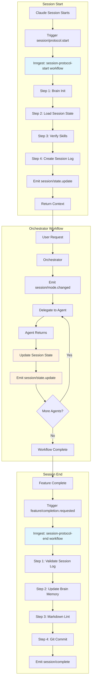

# Automatic Session Protocol Enforcement via Inngest Workflows

## Context and Problem Statement

The session protocol documented in SESSION-PROTOCOL.md defines 8 MUST-level requirements at session start and 10 MUST-level requirements at session end. The original ADR-016 design used hooks and a protocol coordinator service, but this design has critical gaps:

1. **No orchestrator workflow tracking** - When orchestrator delegates to agents, the workflow state is not captured in session state
2. **No agent handoff preservation** - Brain specialist agent context is lost during compaction/conversation resets
3. **HANDOFF.md dependency** - Separate file creates synchronization issues with session state
4. **Hook-based enforcement** - Hooks are synchronous checks, not workflow orchestration
5. **No integration with existing workflows** - Ignores existing Inngest workflows (session-state-update, feature-completion, hitl-approval)

**Root cause:** The design treated session protocol as a validation problem rather than a workflow orchestration problem.

**Critical requirement:** Session state must track the FULL orchestrator workflow, including:

- Which agent is currently active
- Agent routing history (which agents were called, in what order)
- Decisions made during orchestration
- Verdicts collected from specialist agents
- Full context of brain specialist agents

**Architecture constraint:** Orchestrator workflows should leverage existing Inngest workflows and events:

- `session/state.update` - Session state changes
- `session/mode.changed` - Workflow mode transitions
- `feature/completion.requested` - Feature completion validation
- `approval/requested` - Human-in-the-loop approval gates

## Decision Drivers

1. **Workflow-based enforcement** - Session protocol as Inngest workflow with validation steps
2. **Orchestrator state tracking** - Full tracking of agent routing, decisions, verdicts, context
3. **Agent handoff preservation** - Brain specialist context survives compaction and conversation resets
4. **HANDOFF.md elimination** - Session state + Brain MCP notes provide all cross-session context
5. **Existing architecture integration** - Use existing Inngest workflows and events
6. **Observable evidence** - Every step produces verifiable artifacts
7. **Fail-safe defaults** - Work is blocked when protocol requirements are not met

## Considered Options

### Option 1: Hook-Based Protocol Enforcement (Original ADR-016 Design)

**Architecture:** (See original ADR-016 above)

**Pros:**

- Automatic protocol execution via SessionStart hook
- Blocking gate enforcement via PreToolUse hook
- State survives MCP server restarts (file cache)

**Cons:**

- **Does NOT track orchestrator workflow** - No visibility into agent routing
- **Does NOT preserve agent handoffs** - Brain specialist context lost
- **Does NOT eliminate HANDOFF.md** - Still requires separate file
- **Does NOT use Inngest workflows** - Custom protocol coordinator duplicates workflow logic
- Hooks are synchronous checks, not workflow orchestration
- Cache staleness risk

---

### Option 2: Inngest Workflow-Based Protocol Enforcement (RECOMMENDED)

**Architecture:**



**Extended Session State:**

```typescript
interface SessionState {
  // Core session identity
  sessionId: string;
  currentMode: WorkflowMode;  // analysis|planning|coding|disabled
  modeHistory: ModeHistoryEntry[];

  // Protocol compliance tracking
  protocolStartComplete: boolean;
  protocolEndComplete: boolean;
  protocolStartEvidence: Record<string, string>;
  protocolEndEvidence: Record<string, string>;

  // Orchestrator workflow tracking (NEW)
  orchestratorWorkflow?: OrchestratorWorkflow;

  // Feature/task context
  activeFeature?: string;
  activeTask?: string;

  // Timestamps
  createdAt: string;
  updatedAt: string;
}

interface OrchestratorWorkflow {
  // Current state
  activeAgent: AgentType | null;
  workflowPhase: "planning" | "implementation" | "validation" | "complete";

  // Agent routing history (NEW - critical for handoff preservation)
  agentHistory: AgentInvocation[];

  // Decisions and verdicts (NEW - critical for orchestrator context)
  decisions: Decision[];
  verdicts: Verdict[];

  // Pending handoffs (NEW - critical for brain specialist context)
  pendingHandoffs: Handoff[];

  // Workflow metadata
  startedAt: string;
  lastAgentChange: string;
}

interface AgentInvocation {
  agent: AgentType;
  startedAt: string;
  completedAt: string | null;
  status: "in_progress" | "completed" | "failed" | "blocked";

  // Full agent context (NEW - survives compaction)
  input: {
    prompt: string;
    context: Record<string, any>;
    artifacts: string[];  // Paths to input artifacts
  };

  output: {
    artifacts: string[];  // Paths to output artifacts
    summary: string;
    recommendations: string[];
    blockers: string[];
  } | null;

  // Handoff metadata
  handoffFrom: AgentType | null;
  handoffTo: AgentType | null;
  handoffReason: string;
}

interface Decision {
  id: string;
  type: "architectural" | "technical" | "process" | "scope";
  description: string;
  rationale: string;
  decidedBy: AgentType;
  approvedBy?: AgentType[];
  rejectedBy?: AgentType[];
  timestamp: string;
}

interface Verdict {
  agent: AgentType;
  decision: "approve" | "reject" | "conditional" | "needs_revision";
  confidence: number;  // 0-100
  reasoning: string;
  conditions?: string[];  // If conditional approval
  blockers?: string[];    // If rejection
  timestamp: string;
}

interface Handoff {
  fromAgent: AgentType;
  toAgent: AgentType;
  reason: string;
  context: string;  // Full context for next agent
  artifacts: string[];
  preservedContext?: Record<string, any>;  // Brain specialist context
  createdAt: string;
}

type AgentType =
  | "orchestrator"
  | "analyst"
  | "architect"
  | "planner"
  | "implementer"
  | "critic"
  | "qa"
  | "security"
  | "devops"
  | "retrospective"
  | "memory"
  | "skillbook"
  | "independent-thinker"
  | "high-level-advisor"
  | "explainer"
  | "task-generator"
  | "pr-comment-responder";

type WorkflowMode = "analysis" | "planning" | "coding" | "disabled";
```

**Inngest Workflows:**

```typescript
// Workflow 1: session-protocol-start
export const sessionProtocolStart = inngest.createFunction(
  { id: "session-protocol-start" },
  { event: "session/protocol.start" },
  async ({ event, step }) => {
    const sessionId = event.data.sessionId;

    // Step 1: Initialize Brain MCP
    const brainInit = await step.run("brain-init", async () => {
      return await brainMCP.buildContext({ project: process.cwd() });
    });

    // Step 2: Load session state (or create new)
    const sessionState = await step.run("load-session-state", async () => {
      const existing = await sessionService.getSession(sessionId);
      if (existing) return existing;

      return await sessionService.createSession({
        sessionId,
        currentMode: "analysis",
        protocolStartComplete: false,
        protocolEndComplete: false,
        protocolStartEvidence: {},
        protocolEndEvidence: {},
        orchestratorWorkflow: null,
        createdAt: new Date().toISOString(),
        updatedAt: new Date().toISOString(),
      });
    });

    // Step 3: Verify skills directory
    const skillsVerified = await step.run("verify-skills", async () => {
      const skillsDir = path.join(process.cwd(), ".claude", "skills");
      const skills = await fs.promises.readdir(skillsDir, { recursive: true });
      return skills.filter(f => f.endsWith(".ps1") || f.endsWith(".sh")).length;
    });

    // Step 4: Create session log
    const sessionLogPath = await step.run("create-session-log", async () => {
      const sessionsDir = path.join(process.cwd(), ".agents", "sessions");
      const sessionLogs = await fs.promises.readdir(sessionsDir);
      const sessionNumber = sessionLogs.length + 1;
      const date = new Date().toISOString().split("T")[0];
      const logPath = path.join(
        sessionsDir,
        `${date}-session-${sessionNumber.toString().padStart(2, "0")}.md`
      );

      await fs.promises.writeFile(logPath, generateSessionLogTemplate(sessionId));
      return logPath;
    });

    // Step 5: Load constraints from Brain notes
    const constraints = await step.run("load-constraints", async () => {
      return await brainMCP.readNote({
        identifier: "usage-mandatory",
        project: process.cwd(),
      });
    });

    // Step 6: Verify git branch
    const branch = await step.run("verify-branch", async () => {
      const result = await exec("git branch --show-current");
      return result.stdout.trim();
    });

    // Step 7: Update session state with protocol evidence
    await step.run("update-protocol-state", async () => {
      await sessionService.updateSession(sessionId, {
        protocolStartComplete: true,
        protocolStartEvidence: {
          brainInit: "Brain MCP initialized",
          skillsVerified: `${skillsVerified} scripts found`,
          sessionLogCreated: sessionLogPath,
          constraintsRead: "usage-mandatory loaded",
          branchVerified: branch,
        },
        updatedAt: new Date().toISOString(),
      });
    });

    // Step 8: Emit session state update
    await step.sendEvent("session-state-updated", {
      name: "session/state.update",
      data: {
        sessionId,
        protocolStartComplete: true,
      },
    });

    // Return aggregated context for Claude
    return {
      sessionId,
      context: {
        brainInit,
        constraints,
        skills: skillsVerified,
        branch,
        sessionLog: sessionLogPath,
      },
    };
  }
);

// Workflow 2: session-state-update (existing, extended)
export const sessionStateUpdate = inngest.createFunction(
  { id: "session-state-update" },
  { event: "session/state.update" },
  async ({ event, step }) => {
    const { sessionId, updates } = event.data;

    // Update session state
    await step.run("update-session", async () => {
      return await sessionService.updateSession(sessionId, {
        ...updates,
        updatedAt: new Date().toISOString(),
      });
    });

    // If orchestrator workflow update, persist agent history
    if (updates.orchestratorWorkflow) {
      await step.run("persist-agent-history", async () => {
        const workflow = updates.orchestratorWorkflow;

        // Store agent invocation in session state
        await sessionService.addAgentInvocation(sessionId, workflow.agentHistory[workflow.agentHistory.length - 1]);

        // If brain specialist agent, preserve full context in Brain notes
        if (isBrainSpecialist(workflow.activeAgent)) {
          await brainMCP.writeNote({
            title: `session-${sessionId}-agent-${workflow.activeAgent}`,
            content: JSON.stringify(workflow.agentHistory[workflow.agentHistory.length - 1], null, 2),
            category: "session-agents",
          });
        }
      });
    }

    return { updated: true };
  }
);

// Workflow 3: session-protocol-end (NEW)
export const sessionProtocolEnd = inngest.createFunction(
  { id: "session-protocol-end" },
  { event: "feature/completion.requested" },
  async ({ event, step }) => {
    const { sessionId } = event.data;

    // Step 1: Validate session log completeness
    const sessionLog = await step.run("validate-session-log", async () => {
      const sessionState = await sessionService.getSession(sessionId);
      const logPath = sessionState.protocolStartEvidence.sessionLogCreated;

      // Run PowerShell validation script
      const result = await exec(
        `pwsh scripts/Validate-SessionProtocol.ps1 -SessionLogPath "${logPath}" -CI`
      );

      if (result.code !== 0) {
        throw new Error(`Session log validation failed: ${result.stderr}`);
      }

      return logPath;
    });

    // Step 2: Update Brain memory with session learnings
    await step.run("update-brain-memory", async () => {
      const sessionState = await sessionService.getSession(sessionId);
      const workflow = sessionState.orchestratorWorkflow;

      if (workflow) {
        // Extract key decisions and verdicts
        const summary = {
          decisions: workflow.decisions,
          verdicts: workflow.verdicts,
          agentSequence: workflow.agentHistory.map(a => ({
            agent: a.agent,
            duration: a.completedAt
              ? new Date(a.completedAt).getTime() - new Date(a.startedAt).getTime()
              : null,
            status: a.status,
          })),
        };

        await brainMCP.writeNote({
          title: `session-${sessionId}-summary`,
          content: JSON.stringify(summary, null, 2),
          category: "session-learnings",
        });
      }
    });

    // Step 3: Markdown lint
    await step.run("markdown-lint", async () => {
      await exec('npx markdownlint-cli2 --fix "**/*.md"');
    });

    // Step 4: Git commit (if changes exist)
    const commitSha = await step.run("git-commit", async () => {
      const statusResult = await exec("git status --porcelain");
      if (statusResult.stdout.trim() === "") {
        return null; // No changes to commit
      }

      await exec("git add .agents/");
      const commitResult = await exec(
        `git commit -m "chore: session ${sessionId} artifacts"`
      );

      const shaResult = await exec("git rev-parse HEAD");
      return shaResult.stdout.trim();
    });

    // Step 5: Update session state with end evidence
    await step.run("update-end-protocol-state", async () => {
      await sessionService.updateSession(sessionId, {
        protocolEndComplete: true,
        protocolEndEvidence: {
          sessionLogValidated: sessionLog,
          brainMemoryUpdated: "Session learnings stored",
          markdownLintRan: "Lint complete",
          gitCommitted: commitSha || "No changes to commit",
        },
        updatedAt: new Date().toISOString(),
      });
    });

    // Step 6: Emit session complete
    await step.sendEvent("session-completed", {
      name: "session/complete",
      data: {
        sessionId,
        commitSha,
      },
    });

    return {
      sessionId,
      sessionLog,
      commitSha,
    };
  }
);

// Workflow 4: orchestrator-agent-routing (NEW - tracks orchestrator workflow)
export const orchestratorAgentRouting = inngest.createFunction(
  { id: "orchestrator-agent-routing" },
  { event: "orchestrator/agent.invoke" },
  async ({ event, step }) => {
    const { sessionId, targetAgent, prompt, context, handoffReason } = event.data;

    // Step 1: Get current session state
    const sessionState = await step.run("get-session-state", async () => {
      return await sessionService.getSession(sessionId);
    });

    // Step 2: Update orchestrator workflow with new agent invocation
    const invocation = await step.run("create-agent-invocation", async () => {
      const currentAgent = sessionState.orchestratorWorkflow?.activeAgent;

      const inv: AgentInvocation = {
        agent: targetAgent,
        startedAt: new Date().toISOString(),
        completedAt: null,
        status: "in_progress",
        input: {
          prompt,
          context,
          artifacts: context.artifacts || [],
        },
        output: null,
        handoffFrom: currentAgent,
        handoffTo: null,
        handoffReason,
      };

      return inv;
    });

    // Step 3: Update session state with new agent invocation
    await step.run("update-orchestrator-workflow", async () => {
      const workflow = sessionState.orchestratorWorkflow || {
        activeAgent: null,
        workflowPhase: "planning",
        agentHistory: [],
        decisions: [],
        verdicts: [],
        pendingHandoffs: [],
        startedAt: new Date().toISOString(),
        lastAgentChange: new Date().toISOString(),
      };

      workflow.activeAgent = targetAgent;
      workflow.agentHistory.push(invocation);
      workflow.lastAgentChange = new Date().toISOString();

      await sessionService.updateSession(sessionId, {
        orchestratorWorkflow: workflow,
        updatedAt: new Date().toISOString(),
      });
    });

    // Step 4: Emit session state update
    await step.sendEvent("state-updated", {
      name: "session/state.update",
      data: {
        sessionId,
        updates: {
          orchestratorWorkflow: sessionState.orchestratorWorkflow,
        },
      },
    });

    return { invocationCreated: true };
  }
);

// Workflow 5: agent-completion-handler (NEW - tracks agent returns)
export const agentCompletionHandler = inngest.createFunction(
  { id: "agent-completion-handler" },
  { event: "orchestrator/agent.complete" },
  async ({ event, step }) => {
    const { sessionId, agent, artifacts, summary, recommendations, blockers, verdict } = event.data;

    // Step 1: Update agent invocation with output
    await step.run("update-agent-invocation", async () => {
      const sessionState = await sessionService.getSession(sessionId);
      const workflow = sessionState.orchestratorWorkflow!;

      // Find the in-progress invocation for this agent
      const invocation = workflow.agentHistory
        .filter(a => a.agent === agent && a.status === "in_progress")
        .sort((a, b) => new Date(b.startedAt).getTime() - new Date(a.startedAt).getTime())[0];

      if (invocation) {
        invocation.completedAt = new Date().toISOString();
        invocation.status = blockers && blockers.length > 0 ? "blocked" : "completed";
        invocation.output = {
          artifacts,
          summary,
          recommendations,
          blockers: blockers || [],
        };
      }

      // Add verdict if provided
      if (verdict) {
        workflow.verdicts.push({
          agent,
          decision: verdict.decision,
          confidence: verdict.confidence,
          reasoning: verdict.reasoning,
          conditions: verdict.conditions,
          blockers: verdict.blockers,
          timestamp: new Date().toISOString(),
        });
      }

      await sessionService.updateSession(sessionId, {
        orchestratorWorkflow: workflow,
        updatedAt: new Date().toISOString(),
      });
    });

    // Step 2: Emit session state update
    await step.sendEvent("state-updated", {
      name: "session/state.update",
      data: {
        sessionId,
        updates: {
          orchestratorWorkflow: sessionState.orchestratorWorkflow,
        },
      },
    });

    return { completionRecorded: true };
  }
);
```

**SessionStart Hook Integration:**

```go
// In SessionStart/main.go
func RunSessionStart() error {
  sessionId := uuid.New().String()

  // Trigger session protocol start workflow
  err := triggerInngestEvent("session/protocol.start", map[string]any{
    "sessionId": sessionId,
  })
  if err != nil {
    return fmt.Errorf("failed to trigger session protocol: %w", err)
  }

  // Wait for protocol completion (with timeout)
  ctx, cancel := context.WithTimeout(context.Background(), 30*time.Second)
  defer cancel()

  result, err := waitForProtocolCompletion(ctx, sessionId)
  if err != nil {
    return fmt.Errorf("protocol completion failed: %w", err)
  }

  // Return aggregated context to Claude
  return outputJSON(result)
}

func waitForProtocolCompletion(ctx context.Context, sessionId string) (*ProtocolResult, error) {
  ticker := time.NewTicker(500 * time.Millisecond)
  defer ticker.Stop()

  for {
    select {
    case <-ctx.Done():
      return nil, ctx.Err()
    case <-ticker.C:
      // Poll session state via MCP
      state, err := getSessionState(sessionId)
      if err != nil {
        return nil, err
      }

      if state.ProtocolStartComplete {
        return &ProtocolResult{
          SessionId: sessionId,
          Context:   state.ProtocolStartEvidence,
        }, nil
      }
    }
  }
}
```

**PreToolUse Hook Integration (via Brain CLI):**

```go
// In pre_tool_use.go
func PerformGateCheck(toolName string) GateCheckResult {
  // Hooks CANNOT access MCP directly
  // Use Brain CLI to query session state from Brain notes
  cmd := exec.Command("brain", "session", "get-state")
  output, err := cmd.Output()
  if err != nil {
    return GateCheckResult{
      Allowed: false,
      Message: "Failed to query session state via Brain CLI",
    }
  }

  // Parse session state from Brain CLI output
  var state SessionState
  if err := json.Unmarshal(output, &state); err != nil {
    return GateCheckResult{
      Allowed: false,
      Message: "Failed to parse session state",
    }
  }

  // Check if protocol start is complete
  if !state.ProtocolStartComplete {
    return GateCheckResult{
      Allowed: false,
      Message: "Session protocol incomplete. Waiting for initialization...",
      Mode:    "blocked",
    }
  }

  // Allow tool
  return GateCheckResult{
    Allowed: true,
  }
}
```

**Brain CLI implementation:**

```typescript
// brain session get-state command
// Queries Brain MCP for current session state
export async function getSessionState(): Promise<SessionState> {
  // Read current session ID from Brain note
  const currentNote = await brainMCP.readNote({
    identifier: "sessions/current-session",
    project: process.cwd(),
  });

  const sessionId = currentNote.content.trim();

  // Read full session state from Brain note
  const sessionNote = await brainMCP.readNote({
    identifier: `sessions/session-${sessionId}`,
    project: process.cwd(),
  });

  return JSON.parse(sessionNote.content) as SessionState;
}
```

**Key architecture points:**

1. **Hooks → Brain CLI → MCP → Brain notes** (data flow)
2. **No JSON file cache** - Brain notes are the only persistent storage
3. **Brain CLI provides hook interface** - Hooks cannot call MCP directly
4. **MCP restart safe** - Session state always in Brain notes, reloaded on startup

**HANDOFF.md Elimination:**

Instead of HANDOFF.md, cross-session context comes from:

1. **Session State** (via session service):
   - Orchestrator workflow history
   - Agent invocations and outputs
   - Decisions and verdicts
   - Current workflow phase

2. **Brain MCP Notes** (via brain service):
   - `session-{sessionId}-summary` - Session learnings
   - `session-{sessionId}-agent-{agent}` - Full agent context (for brain specialists)
   - Feature/epic notes with wikilinks to sessions
   - ADRs created during session

3. **Session Logs** (in `.agents/sessions/`):
   - Permanent audit trail
   - Protocol compliance evidence
   - Timeline of events

**Pros:**

- **Tracks orchestrator workflow** - Full agent routing history in session state
- **Preserves agent handoffs** - Brain specialist context stored in Brain notes
- **Eliminates HANDOFF.md** - Session state + Brain notes provide all context
- **Uses existing workflows** - Integrates with session-state-update, feature-completion
- **Survives compaction** - Session state persists across conversation resets
- **Observable evidence** - Every step produces verifiable artifacts
- **Workflow orchestration** - Inngest handles retry, failure, and observability

**Cons:**

- Requires significant changes to session service schema
- Inngest workflow adds complexity vs. simple hook
- Session state can grow large with full agent context
- Requires Brain MCP for full functionality (graceful degradation needed)

**Neutral:**

- SessionStart hook triggers workflow instead of executing directly
- More event-driven (events: session/protocol.start, orchestrator/agent.invoke, etc.)

---

### Option 3: Hybrid Hook + Workflow Approach

**Architecture:** (Combining elements of Options 1 and 2)

SessionStart hook directly executes protocol steps (fast path), but also emits events for workflow tracking. Orchestrator workflow tracked via events, but protocol validation remains hook-based.

**Pros:**

- Fast session start (no workflow orchestration overhead)
- Orchestrator workflow still tracked via events
- Simpler than full Inngest migration

**Cons:**

- Dual code paths (hooks + workflows) increases complexity
- Protocol logic split between hooks and workflows
- Does not fully eliminate HANDOFF.md
- Harder to maintain consistency between hooks and events

---

## Decision Outcome

**Chosen option: Option 2 - Inngest Workflow-Based Protocol Enforcement**

**CRITICAL ARCHITECTURAL CORRECTION (2026-01-18):**

The original ADR-016 implementation had a fundamental persistence architecture flaw that has been corrected:

| Aspect | WRONG (Original) | CORRECT (This Version) |
|--------|-----------------|----------------------|
| **Source of truth** | `session.json` file cache | Brain MCP notes |
| **Persistence** | In-memory + file cache + Brain notes | In-memory cache + Brain notes only |
| **Hook access** | Direct MCP calls | Brain CLI → MCP → Brain notes |
| **MCP restart** | Load from file cache | Load from Brain notes |
| **Data flow** | MCP → file cache → hooks | MCP → Brain notes → Brain CLI → hooks |

**Why this matters:**

1. **Brain notes are durable** - They survive MCP shutdown, restart, and system reboot
2. **No file cache needed** - Brain is already a persistent knowledge graph
3. **Single source of truth** - Brain notes, not ephemeral JSON files
4. **Architectural consistency** - Everything uses Brain for persistence

**Key insight:** Brain MCP notes ARE the durable storage layer. That's the whole point of Brain - a persistent knowledge graph. We should use it for session state, not duplicate persistence with file caches.

**Correct architecture diagram:**

```mermaid
flowchart TD
    subgraph "Claude Hooks (Go)"
        SH[SessionStart Hook]
        PTU[PreToolUse Hook]
    end

    subgraph "Brain CLI"
        CLI[brain session get-state/set-state]
    end

    subgraph "MCP Server (TypeScript)"
        MCP[Session Service]
        CACHE[In-Memory Cache]
    end

    subgraph "Brain Knowledge Graph (Durable)"
        NOTES[Brain Notes]
        CURRENT[sessions/current-session]
        STATE[sessions/session-{id}]
    end

    SH -->|calls| CLI
    PTU -->|calls| CLI
    CLI -->|queries| MCP
    MCP -->|reads/writes| NOTES
    MCP -->|cached in| CACHE
    NOTES -->|contains| CURRENT
    NOTES -->|contains| STATE

    RESTART[MCP Restart] -->|loads from| NOTES
    RESTART -->|populates| CACHE

    style NOTES fill:#4caf50
    style CLI fill:#2196f3
    style MCP fill:#ff9800
    style CACHE fill:#ffc107
```

**Data flow:**

1. **Write path**: MCP → Brain notes (+ update cache)
2. **Read path (hooks)**: Hook → Brain CLI → MCP → cache (or Brain notes if cache miss)
3. **Read path (MCP startup)**: MCP → Brain notes → cache
4. **Restart recovery**: Brain notes → MCP memory cache

**No file cache anywhere** - Brain notes are the only durable storage.

---

**Justification:**

Option 2 provides the complete solution for all critical requirements:

1. **Orchestrator workflow tracking** - Full agent routing history, decisions, verdicts captured in session state
2. **Agent handoff preservation** - Brain specialist context stored in Brain notes, survives compaction
3. **HANDOFF.md elimination** - Session state + Brain notes provide all cross-session context
4. **Workflow orchestration** - Inngest handles retry, observability, and complex multi-step protocols
5. **Integration with existing architecture** - Uses existing Inngest workflows and events

The workflow approach treats session protocol as a first-class orchestrated process rather than a validation check. This enables:

- Automatic retry on transient failures
- Observable step-by-step execution
- Event-driven updates to session state
- Human-in-the-loop approval gates (if needed)
- Comprehensive audit trail

Compared to Option 1 (original ADR-016), Option 2:

- Tracks orchestrator workflow (Option 1 did not)
- Preserves brain specialist context (Option 1 did not)
- Eliminates HANDOFF.md (Option 1 kept it)
- Uses Inngest workflows (Option 1 used custom coordinator)

Compared to Option 3, Option 2:

- Single source of truth (workflows only, not hooks + workflows)
- Simpler mental model (everything is a workflow)
- Better long-term maintainability (no dual code paths)

### Consequences

**Good:**

- Full orchestrator workflow visibility in session state
- Brain specialist agent context preserved across compactions
- HANDOFF.md eliminated (one less file to maintain)
- Event-driven architecture enables future extensibility
- Inngest provides retry, observability, debugging tools
- Session state is the canonical source of workflow context
- Cross-session context via session state + Brain notes (no synchronization issues)

**Bad:**

- Significant changes to session service schema (breaks existing sessions)
- Inngest workflow overhead for session start (async, not synchronous)
- Session state can grow large (needs compaction strategy)
- Requires Brain MCP for full functionality (though can degrade gracefully)
- More complex testing (workflow + events + state synchronization)

**Migration needed:**

- Existing sessions need migration to new session state schema
- HANDOFF.md content needs one-time migration to Brain notes
- SessionStart hook needs rewrite to trigger workflows
- Session service needs schema extension and migration script

### Confirmation

**Implementation validation:**

1. **Unit tests**:
   - [ ] Session state schema validation
   - [ ] Workflow step execution (each Inngest function)
   - [ ] Agent invocation tracking
   - [ ] Verdict and decision recording

2. **Integration tests**:
   - [ ] SessionStart hook → session-protocol-start workflow
   - [ ] Orchestrator → agent routing → state update
   - [ ] Agent completion → verdict recording
   - [ ] Feature completion → session-protocol-end workflow
   - [ ] Brain specialist context preservation

3. **End-to-end tests**:
   - [ ] Full orchestrator workflow tracked in session state
   - [ ] Agent handoffs preserved across conversation resets
   - [ ] HANDOFF.md not needed (all context from state + Brain)
   - [ ] Session compaction preserves critical context

4. **Migration tests**:
   - [ ] Old session state migrated to new schema
   - [ ] HANDOFF.md content migrated to Brain notes
   - [ ] Existing sessions continue to work

**Acceptance criteria:**

- [ ] SessionStart hook triggers session-protocol-start workflow
- [ ] Session state tracks orchestrator workflow with full agent history
- [ ] Brain specialist agent context persists in Brain notes
- [ ] HANDOFF.md file removed from repository
- [ ] Cross-session context available via session state + Brain notes
- [ ] Validate-SessionProtocol.ps1 validates session log Evidence column
- [ ] Feature completion triggers session-protocol-end workflow
- [ ] All Inngest events emit and workflows execute successfully

---

## Implementation Approach

### Phase 1: Session State Schema Extension (Week 1)

**Files to modify:**

- `apps/mcp/src/services/session/types.ts` - Extend SessionState interface
- `apps/mcp/src/services/session/index.ts` - Add new methods for orchestrator workflow
- `apps/mcp/src/services/session/brain-persistence.ts` - NEW: Brain note persistence (replaces file cache)

**New interfaces to add:**

```typescript
// In types.ts
export interface OrchestratorWorkflow {
  activeAgent: AgentType | null;
  workflowPhase: "planning" | "implementation" | "validation" | "complete";
  agentHistory: AgentInvocation[];
  decisions: Decision[];
  verdicts: Verdict[];
  pendingHandoffs: Handoff[];
  startedAt: string;
  lastAgentChange: string;
}

export interface AgentInvocation {
  agent: AgentType;
  startedAt: string;
  completedAt: string | null;
  status: "in_progress" | "completed" | "failed" | "blocked";
  input: {
    prompt: string;
    context: Record<string, any>;
    artifacts: string[];
  };
  output: {
    artifacts: string[];
    summary: string;
    recommendations: string[];
    blockers: string[];
  } | null;
  handoffFrom: AgentType | null;
  handoffTo: AgentType | null;
  handoffReason: string;
}

// ... Decision, Verdict, Handoff interfaces (see Option 2 above)
```

**New methods to add:**

```typescript
// In index.ts
export class SessionService {
  // ... existing methods ...

  async addAgentInvocation(
    sessionId: string,
    invocation: AgentInvocation
  ): Promise<void> {
    const session = await this.getSession(sessionId);
    if (!session.orchestratorWorkflow) {
      session.orchestratorWorkflow = {
        activeAgent: null,
        workflowPhase: "planning",
        agentHistory: [],
        decisions: [],
        verdicts: [],
        pendingHandoffs: [],
        startedAt: new Date().toISOString(),
        lastAgentChange: new Date().toISOString(),
      };
    }

    session.orchestratorWorkflow.agentHistory.push(invocation);
    session.orchestratorWorkflow.activeAgent = invocation.agent;
    session.orchestratorWorkflow.lastAgentChange = new Date().toISOString();
    session.updatedAt = new Date().toISOString();

    await this.saveSession(session);
  }

  async addDecision(sessionId: string, decision: Decision): Promise<void> {
    const session = await this.getSession(sessionId);
    if (!session.orchestratorWorkflow) {
      throw new Error("No orchestrator workflow to add decision to");
    }

    session.orchestratorWorkflow.decisions.push(decision);
    session.updatedAt = new Date().toISOString();

    await this.saveSession(session);
  }

  async addVerdict(sessionId: string, verdict: Verdict): Promise<void> {
    const session = await this.getSession(sessionId);
    if (!session.orchestratorWorkflow) {
      throw new Error("No orchestrator workflow to add verdict to");
    }

    session.orchestratorWorkflow.verdicts.push(verdict);
    session.updatedAt = new Date().toISOString();

    await this.saveSession(session);
  }

  async completeAgentInvocation(
    sessionId: string,
    agent: AgentType,
    output: AgentInvocation["output"]
  ): Promise<void> {
    const session = await this.getSession(sessionId);
    if (!session.orchestratorWorkflow) {
      throw new Error("No orchestrator workflow");
    }

    // Find the in-progress invocation for this agent
    const invocation = session.orchestratorWorkflow.agentHistory
      .filter(a => a.agent === agent && a.status === "in_progress")
      .sort((a, b) => new Date(b.startedAt).getTime() - new Date(a.startedAt).getTime())[0];

    if (invocation) {
      invocation.completedAt = new Date().toISOString();
      invocation.status = output.blockers.length > 0 ? "blocked" : "completed";
      invocation.output = output;
    }

    session.updatedAt = new Date().toISOString();
    await this.saveSession(session);
  }
}
```

**Brain persistence implementation:**

```typescript
// In brain-persistence.ts
export class BrainSessionPersistence {
  constructor(private brainMCP: BrainMCPClient) {}

  async saveSession(session: SessionState): Promise<void> {
    // Write to Brain note (source of truth)
    await this.brainMCP.writeNote({
      title: `sessions/session-${session.sessionId}`,
      content: JSON.stringify(session, null, 2),
      category: "sessions",
      project: process.cwd(),
    });

    // Update current session pointer
    await this.brainMCP.writeNote({
      title: "sessions/current-session",
      content: session.sessionId,
      category: "sessions",
      project: process.cwd(),
    });
  }

  async loadSession(sessionId: string): Promise<SessionState | null> {
    try {
      const note = await this.brainMCP.readNote({
        identifier: `sessions/session-${sessionId}`,
        project: process.cwd(),
      });

      return JSON.parse(note.content) as SessionState;
    } catch (err) {
      return null; // Session not found
    }
  }

  async getCurrentSession(): Promise<SessionState | null> {
    try {
      const currentNote = await this.brainMCP.readNote({
        identifier: "sessions/current-session",
        project: process.cwd(),
      });

      const sessionId = currentNote.content.trim();
      return await this.loadSession(sessionId);
    } catch (err) {
      return null; // No current session
    }
  }
}
```

**Implementation checklist:**

- [ ] Extend SessionState interface with orchestratorWorkflow
- [ ] Add OrchestratorWorkflow, AgentInvocation, Decision, Verdict, Handoff interfaces
- [ ] Implement addAgentInvocation, addDecision, addVerdict methods
- [ ] Implement completeAgentInvocation method
- [ ] **DELETE** file cache storage (session.json)
- [ ] **CREATE** BrainSessionPersistence class (Brain note storage)
- [ ] Add MCP startup logic to load session from Brain notes
- [ ] Add migration script for existing sessions (file cache → Brain notes)
- [ ] Add unit tests for new methods
- [ ] Add integration tests for Brain persistence

---

### Phase 2: Inngest Workflows Implementation (Week 1-2)

**Files to create:**

- `apps/mcp/src/workflows/session-protocol-start.ts`
- `apps/mcp/src/workflows/session-protocol-end.ts`
- `apps/mcp/src/workflows/orchestrator-agent-routing.ts`
- `apps/mcp/src/workflows/agent-completion-handler.ts`

**Workflow implementations:** (See Option 2 above for full code)

**Implementation checklist:**

- [ ] Create session-protocol-start workflow
- [ ] Create session-protocol-end workflow
- [ ] Create orchestrator-agent-routing workflow
- [ ] Create agent-completion-handler workflow
- [ ] Add event emission helpers
- [ ] Add workflow testing utilities
- [ ] Document workflow interactions
- [ ] Add integration tests for each workflow

---

### Phase 3: Hook Integration + Brain CLI Bridge (Week 2)

**Files to create:**

- `apps/cli/src/commands/session/get-state.ts` - Brain CLI command for hooks
- `apps/cli/src/commands/session/set-state.ts` - Brain CLI command for workflows

**Files to modify:**

- `apps/claude-plugin/hooks/SessionStart/main.go`
- `apps/claude-plugin/cmd/hooks/pre_tool_use.go`

**SessionStart hook changes:** (See Option 2 above for full code)

**Key changes:**

1. Trigger `session/protocol.start` event via Inngest
2. Wait for protocol completion by polling session state via Brain CLI
3. Return aggregated context from session state

**PreToolUse hook changes:**

1. Call `brain session get-state` to read session state from Brain notes
2. Parse JSON output from Brain CLI
3. Check `protocolStartComplete` flag
4. Block tools if protocol incomplete
5. Allow tools if protocol complete

**Brain CLI implementation:**

1. `brain session get-state` - Queries MCP, reads from Brain note `sessions/current-session`
2. `brain session set-state` - Updates MCP, writes to Brain note `sessions/session-{id}`
3. Returns JSON output for hook consumption
4. Handles MCP connection errors gracefully

**Implementation checklist:**

- [ ] Create Brain CLI `session get-state` command
- [ ] Create Brain CLI `session set-state` command
- [ ] Update SessionStart hook to trigger Inngest workflow
- [ ] Update SessionStart hook to poll via Brain CLI (not direct MCP)
- [ ] Update PreToolUse hook to call Brain CLI (not direct MCP)
- [ ] Add blocking logic for incomplete protocol
- [ ] Add timeout handling for workflow delays
- [ ] Add graceful degradation if Brain CLI fails
- [ ] Test hook → Brain CLI → MCP → Brain notes flow end-to-end

---

### Phase 4: HANDOFF.md Elimination (Week 2)

**Migration strategy:**

1. **One-time migration script:**
   - Read existing HANDOFF.md content
   - Parse sections (Active Feature, Progress, Decisions, Blockers, Next Steps)
   - Migrate to Brain notes with appropriate categories
   - Create initial session state with orchestrator workflow

2. **Documentation updates:**
   - Remove HANDOFF.md references from SESSION-PROTOCOL.md
   - Update AGENTS.md to reference session state + Brain notes
   - Update bootstrap.md to remove HANDOFF.md mention

3. **Code cleanup:**
   - Remove HANDOFF.md read logic from bootstrap tool
   - Remove HANDOFF.md update logic from session-end workflows
   - Update validation scripts to not expect HANDOFF.md

**Files to create:**

- `scripts/Migrate-HandoffToBrain.ps1` - Migration script

**Files to modify:**

- `.agents/SESSION-PROTOCOL.md` - Remove HANDOFF.md requirement
- `AGENTS.md` - Update memory system section
- `apps/claude-plugin/commands/bootstrap.md` - Remove HANDOFF.md reference
- `apps/mcp/src/tools/bootstrap/index.ts` - Remove HANDOFF.md loading

**Files to delete:**

- `.agents/HANDOFF.md` - After migration complete

**Implementation checklist:**

- [ ] Create migration script Migrate-HandoffToBrain.ps1
- [ ] Run migration on existing repositories
- [ ] Update SESSION-PROTOCOL.md to remove HANDOFF.md
- [ ] Update AGENTS.md memory system documentation
- [ ] Update bootstrap.md command
- [ ] Remove HANDOFF.md loading from bootstrap tool
- [ ] Delete HANDOFF.md after migration verified
- [ ] Update validation scripts

---

### Phase 5: Agent Routing Integration (Week 3)

**Goal:** Orchestrator emits events when delegating to agents, capturing full workflow.

**New agent protocol:**

When orchestrator routes to an agent:

```typescript
// In orchestrator agent implementation
async function delegateToAgent(
  targetAgent: AgentType,
  prompt: string,
  context: Record<string, any>,
  handoffReason: string
): Promise<AgentResult> {
  // Emit agent invocation event
  await inngest.send({
    name: "orchestrator/agent.invoke",
    data: {
      sessionId: getCurrentSessionId(),
      targetAgent,
      prompt,
      context,
      handoffReason,
    },
  });

  // Invoke agent (existing logic)
  const result = await invokeAgent(targetAgent, prompt, context);

  // Emit agent completion event
  await inngest.send({
    name: "orchestrator/agent.complete",
    data: {
      sessionId: getCurrentSessionId(),
      agent: targetAgent,
      artifacts: result.artifacts,
      summary: result.summary,
      recommendations: result.recommendations,
      blockers: result.blockers,
      verdict: result.verdict,
    },
  });

  return result;
}
```

**Brain specialist context preservation:**

For brain specialists (analyst, architect, memory, skillbook), preserve full context:

```typescript
function isBrainSpecialist(agent: AgentType): boolean {
  return ["analyst", "architect", "memory", "skillbook"].includes(agent);
}

// In agent-completion-handler workflow
if (isBrainSpecialist(agent)) {
  await brainMCP.writeNote({
    title: `session-${sessionId}-agent-${agent}`,
    content: JSON.stringify(invocation, null, 2),
    category: "session-agents",
  });
}
```

**Implementation checklist:**

- [ ] Add event emission to orchestrator delegation logic
- [ ] Add event emission to agent completion logic
- [ ] Implement isBrainSpecialist check
- [ ] Add Brain note preservation for specialists
- [ ] Test full orchestrator workflow capture
- [ ] Verify agent context survives compaction

---

### Phase 6: Integration Testing (Week 3)

**Test scenarios:**

1. **Session start protocol**:
   - [ ] SessionStart hook triggers workflow
   - [ ] All protocol steps execute successfully
   - [ ] Session state updated with evidence
   - [ ] PreToolUse hook allows tools after completion

2. **Orchestrator workflow tracking**:
   - [ ] Orchestrator routes to analyst
   - [ ] Agent invocation recorded in session state
   - [ ] Analyst completes, verdict recorded
   - [ ] Orchestrator routes to architect
   - [ ] Full agent history preserved

3. **Brain specialist context preservation**:
   - [ ] Architect invoked, full context captured
   - [ ] Brain note created for architect invocation
   - [ ] Conversation compacted/reset
   - [ ] Architect context retrieved from Brain note
   - [ ] Context complete and usable

4. **HANDOFF.md elimination**:
   - [ ] No HANDOFF.md file exists
   - [ ] Cross-session context available via session state
   - [ ] Cross-session context available via Brain notes
   - [ ] No synchronization issues

5. **Feature completion**:
   - [ ] Feature completion triggers session-protocol-end workflow
   - [ ] Session log validated
   - [ ] Brain memory updated with learnings
   - [ ] Markdown lint runs
   - [ ] Git commit created

6. **Error handling**:
   - [ ] Protocol step fails, workflow retries
   - [ ] Agent invocation fails, recorded in session state
   - [ ] Brain MCP unavailable, graceful degradation

**Implementation checklist:**

- [ ] Create integration test suite
- [ ] Test all scenarios above
- [ ] Add failure injection tests
- [ ] Test migration from old session state
- [ ] Document test coverage
- [ ] Add CI integration for tests

---

### Phase 7: Documentation Updates (Week 3)

**Files to update:**

- `.agents/SESSION-PROTOCOL.md` - Remove HANDOFF.md, add workflow references
- `AGENTS.md` - Update memory system, remove HANDOFF.md references
- `CLAUDE.md` - Update session protocol section
- `.agents/AGENT-SYSTEM.md` - Update workflow documentation
- `apps/claude-plugin/commands/bootstrap.md` - Remove HANDOFF.md mention

**New documentation to create:**

- `.agents/workflows/session-protocol.md` - Workflow architecture documentation
- `.agents/workflows/orchestrator-tracking.md` - Orchestrator workflow tracking guide

**Implementation checklist:**

- [ ] Update SESSION-PROTOCOL.md
- [ ] Update AGENTS.md memory system section
- [ ] Update CLAUDE.md session protocol
- [ ] Update AGENT-SYSTEM.md
- [ ] Update bootstrap.md command
- [ ] Create session-protocol.md workflow docs
- [ ] Create orchestrator-tracking.md guide
- [ ] Update all ADR references to HANDOFF.md

---

## Scope Expansion (2026-01-19)

After initial acceptance (Phases 1-3: Session protocol enforcement), scope expanded to include migration of 13 PowerShell validation scripts to Go compiled to WASM.

**Original Scope (Phases 1-3)**:

- Phase 1: Session state schema extension
- Phase 2: Inngest workflows implementation
- Phase 3: Hook integration and HANDOFF.md elimination

**Expanded Scope (Phases 4-6)**:

- Phase 4 (Week 4): P0 validation scripts (Validate-Consistency, Validate-PrePR)
- Phase 5 (Weeks 5-6): P1 validation scripts (Detect-SkillViolation, etc.)
- Phase 6 (Weeks 7-12): P2 maintenance scripts (Validate-MemoryIndex, etc.)

**Rationale**: Validation scripts require session state access. Go/WASM compilation enables:

- Integration with Inngest workflows
- Pre-commit hook enforcement
- WASM integration across Brain CLI, Inngest, CI

**Timeline Impact**: 3 weeks → 11.5 weeks (8.5 weeks added)
**Effort Impact**: 77 hours (original) → 197 hours (total) = 120 hours added

**Total Migration**: 13 validation scripts migrated to Go with WASM integration and enforcement across all platforms.

---

## P0 Resolutions (Added 2026-01-18 per ADR Review)

**Note (2026-01-19)**: Resolution 3 (HMAC Signing) has been removed. See "Resolution 3 - REMOVED" section below for rationale.

### Resolutions Changelog

**2026-01-18**: Original P0 resolutions created (5 items):

1. Compaction Strategy Specification
2. Concurrent Session Handling (Optimistic Locking)
3. Session State Signing (HMAC-SHA256) ← REMOVED 2026-01-19
4. Fail-Closed Behavior
5. Clean Migration (No Backwards Compatibility)

**2026-01-19**: Resolution 3 (HMAC signing) removed from ADR.

**Rationale for Resolution 3 Removal**:

- Single-user environment: Brain operates in local-first environment where user has full filesystem access
- Filesystem trust model: System already trusts filesystem for all data (notes, code, configuration)
- Threat model mismatch: HMAC protects against external tampering, but in local-first tool, user and "attacker" are same entity
- Operational burden: BRAIN_SESSION_SECRET adds deployment complexity without security benefit
- YAGNI principle: Signing infrastructure implemented speculatively without actual threat

**Security model after removal**: System relies on filesystem permissions, consistent with Brain knowledge graph trust model for single-user, local-first tools.

---

### Resolution 1: Compaction Strategy Specification

**Trigger**: Compaction occurs when `orchestratorWorkflow.agentHistory.length > 10`.

**Compaction Logic**:

```typescript
interface CompactionResult {
  compactedState: SessionState;
  historyNote: string;  // Brain note path for full history
}

async function compactSessionState(session: SessionState): Promise<CompactionResult> {
  const workflow = session.orchestratorWorkflow;
  if (!workflow || workflow.agentHistory.length <= 10) {
    throw new Error("Compaction not needed");
  }

  // Keep last 3 invocations
  const recentInvocations = workflow.agentHistory.slice(-3);
  const historicalInvocations = workflow.agentHistory.slice(0, -3);

  // Generate summary for historical invocations
  const summary = {
    compactedAt: new Date().toISOString(),
    invocationCount: historicalInvocations.length,
    agentsSummary: historicalInvocations.map(inv => ({
      agent: inv.agent,
      status: inv.status,
      startedAt: inv.startedAt,
      completedAt: inv.completedAt,
      // Preserve key metadata, discard full context
      hasBlockers: (inv.output?.blockers?.length ?? 0) > 0,
    })),
    decisionsPreserved: workflow.decisions,  // Never compact decisions
    verdictsPreserved: workflow.verdicts,    // Never compact verdicts
  };

  // Store full history in separate Brain note
  const historyNotePath = `sessions/session-${session.sessionId}-history-${Date.now()}`;
  await brainMCP.writeNote({
    title: historyNotePath,
    content: JSON.stringify({
      sessionId: session.sessionId,
      compactedAt: summary.compactedAt,
      fullHistory: historicalInvocations,
    }, null, 2),
    category: "session-history",
  });

  // Update session state with compacted history
  const compactedWorkflow = {
    ...workflow,
    agentHistory: recentInvocations,
    compactionHistory: [
      ...(workflow.compactionHistory || []),
      { notePath: historyNotePath, compactedAt: summary.compactedAt, count: historicalInvocations.length },
    ],
  };

  return {
    compactedState: { ...session, orchestratorWorkflow: compactedWorkflow },
    historyNote: historyNotePath,
  };
}
```

**Validation**: Compacted state must pass schema validation before persisting.

**Rollback**: Full history preserved in Brain note for 30 days (configurable via `COMPACTION_RETENTION_DAYS`).

---

### Resolution 2: Concurrent Session Handling (Optimistic Locking)

**Problem**: Brain notes don't support atomic operations. Concurrent updates can corrupt state.

**Solution**: Add version field with optimistic locking.

```typescript
interface SessionState {
  // ... existing fields ...

  // Optimistic locking
  version: number;  // Incremented on every update
}

async function updateSessionWithLocking(
  sessionId: string,
  updates: Partial<SessionState>,
  maxRetries: number = 3
): Promise<void> {
  for (let attempt = 0; attempt < maxRetries; attempt++) {
    const current = await loadSessionState(sessionId);
    const expectedVersion = current.version;

    // Apply updates
    const updated = {
      ...current,
      ...updates,
      version: expectedVersion + 1,
      updatedAt: new Date().toISOString(),
    };

    // Write to Brain note
    await brainMCP.writeNote({
      title: `sessions/session-${sessionId}`,
      content: JSON.stringify(updated, null, 2),
    });

    // Verify write succeeded with correct version
    const verification = await loadSessionState(sessionId);
    if (verification.version === expectedVersion + 1) {
      return;  // Success
    }

    // Version conflict - another process updated state
    console.warn(`Version conflict on session ${sessionId}, attempt ${attempt + 1}`);
  }

  throw new Error(`Failed to update session ${sessionId} after ${maxRetries} attempts`);
}
```

**Conflict Resolution**: On version conflict, retry up to 3 times. If all retries fail, return error to caller.

---

### Resolution 3: Session State Signing - REMOVED (2026-01-19)

**Original Problem**: Brain notes are plaintext files that can be tampered with to bypass workflow gates.

**Original Solution**: Sign session state with HMAC-SHA256 using server-side secret.

**REMOVED**: This resolution has been removed entirely.

**Rationale for Removal**:

1. **Single-user environment**: Brain operates in a single-user, local-first environment where the user has full filesystem access. If a user can tamper with session state, they can also modify the signing secret or the verification code itself.

2. **Filesystem trust model**: The system already trusts the filesystem for all other data (notes, code, configuration). Adding signing for session state alone provides no real security benefit while adding complexity.

3. **Threat model mismatch**: HMAC signing protects against external tampering, but in a local-first tool, the "attacker" and "user" are the same entity. If a user wants to bypass workflow gates, they have many simpler options (edit code, modify hooks, delete session state).

4. **Operational burden**: BRAIN_SESSION_SECRET adds deployment complexity, environment variable management, and potential failure modes (secret not set, secret mismatch between components).

5. **YAGNI principle**: The signing infrastructure was implemented speculatively. After implementation, the actual threat it addresses (external tampering in a single-user local tool) does not exist in practice.

**Files removed**:

- `apps/mcp/src/services/session/signing.ts`
- `apps/mcp/src/services/session/__tests__/signing.test.ts`

**Types removed**:

- `SignedSessionState` interface
- `SignedSessionStateSchema` Zod schema
- `_signature` field from all session state types

**Environment variables removed**:

- `BRAIN_SESSION_SECRET`

**Security model after removal**:

The system relies on filesystem permissions for security, consistent with the rest of the Brain knowledge graph. This is the appropriate trust model for a single-user, local-first tool.

---

### Resolution 4: Fail-Closed Behavior

**Problem**: Current gate_check.go fails open when state cannot be read, allowing all tools.

**Solution**: Change to fail-closed with explicit "disabled" mode check.

```go
// In gate_check.go - UPDATED
func PerformGateCheck(tool string) *GateCheckResult {
  state, err := brainCLI.GetSessionState()

  // FAIL CLOSED: If state unavailable, block destructive tools
  if err != nil {
    // Only allow read-only tools when state unknown
    if isReadOnlyTool(tool) {
      return &GateCheckResult{Allowed: true}
    }
    return &GateCheckResult{
      Allowed: false,
      Message: fmt.Sprintf("Session state unavailable. Blocking %s. Use /mode disabled to override.", tool),
      Mode:    "unknown",
    }
  }

  // EXPLICIT DISABLED: Only disabled mode bypasses all gates
  if state.CurrentMode == "disabled" {
    return &GateCheckResult{Allowed: true, Mode: "disabled"}
  }

  // Normal mode-based checking
  return CheckToolBlocked(tool, state.CurrentMode)
}

func isReadOnlyTool(tool string) bool {
  readOnlyTools := []string{"Read", "Glob", "Grep", "LSP", "WebFetch", "WebSearch"}
  for _, t := range readOnlyTools {
    if tool == t {
      return true
    }
  }
  return false
}
```

**Security Implications**:

- `analysis` mode: Read-only tools allowed, Edit/Write/Bash blocked
- `planning` mode: Read-only + Bash allowed, Edit/Write blocked
- `coding` mode: All tools allowed
- `disabled` mode: All tools allowed (explicit opt-out)
- `unknown` mode (error state): Only read-only tools allowed

---

### Resolution 5: Clean Migration (No Backwards Compatibility)

**Approach**: Direct cutover to Brain notes. No parallel operation required.

**Migration Steps**:

1. **Delete file cache**: Remove `~/.local/state/brain/session.json`
2. **Update hooks**: Point to Brain CLI (not file cache)
3. **Start fresh**: New sessions created directly in Brain notes

```typescript
// Clean persistence - Brain notes only
async function persistSession(session: SessionState): Promise<void> {
  await brainMCP.writeNote({
    title: `sessions/session-${session.sessionId}`,
    content: JSON.stringify(signSessionState(session), null, 2),
    category: "sessions",
  });

  // Update current session pointer
  await brainMCP.writeNote({
    title: "sessions/current-session",
    content: session.sessionId,
    category: "sessions",
  });
}

async function loadSession(sessionId: string): Promise<SessionState> {
  const note = await brainMCP.readNote({
    identifier: `sessions/session-${sessionId}`,
  });

  const state = JSON.parse(note.content) as SignedSessionState;
  if (!verifySessionState(state)) {
    throw new Error("Session state signature invalid");
  }

  return state;
}
```

**No Backwards Compatibility**:

- Existing sessions in file cache are NOT migrated
- New sessions start fresh in Brain notes
- File cache code is removed entirely

**Benefits**:

- Simpler implementation
- No dual-write complexity
- No fallback logic
- Clean codebase

---

## Session State Persistence Strategy

**Two-tier persistence (Brain-first architecture):**

1. **Brain notes** (primary, durable, source of truth):
   - `sessions/session-{sessionId}` - Full session state including orchestrator workflow
   - `sessions/current-session` - Pointer to active session for quick lookup
   - `session-{sessionId}-agent-{agent}` - Brain specialist agent context
   - Survives MCP restart, conversation compaction, system reboot
   - Loaded into memory on MCP startup
   - Single source of truth for all session data

2. **In-memory cache** (secondary, performance):
   - Map<sessionId, SessionState> in MCP server process
   - Loaded from Brain notes on MCP startup
   - Updated in sync with Brain note writes
   - Cleared on MCP restart (then reloaded from Brain notes)
   - Cache invalidation handled by note write operations

**State synchronization (Brain-first):**

```typescript
async function updateSessionState(
  sessionId: string,
  updates: Partial<SessionState>
): Promise<void> {
  // Update in-memory cache
  const session = sessionStore.get(sessionId)!;
  Object.assign(session, updates, {
    updatedAt: new Date().toISOString(),
  });

  // Write to Brain note (source of truth)
  await brainMCP.writeNote({
    title: `sessions/session-${sessionId}`,
    content: JSON.stringify(session, null, 2),
    category: "sessions",
    project: process.cwd(),
  });

  // Emit event for workflow tracking
  await inngest.send({
    name: "session/state.update",
    data: { sessionId, updates },
  });
}

async function loadSessionState(sessionId: string): Promise<SessionState> {
  // Read from Brain note (source of truth)
  const note = await brainMCP.readNote({
    identifier: `sessions/session-${sessionId}`,
    project: process.cwd(),
  });

  const session = JSON.parse(note.content) as SessionState;

  // Populate in-memory cache
  sessionStore.set(sessionId, session);

  return session;
}

async function initializeMCP(): Promise<void> {
  // On MCP startup, load current session from Brain
  try {
    const currentNote = await brainMCP.readNote({
      identifier: "sessions/current-session",
      project: process.cwd(),
    });

    const currentSessionId = currentNote.content.trim();
    await loadSessionState(currentSessionId);
  } catch (err) {
    // No current session, will be created on SessionStart
  }
}
```

**Compaction strategy:**

When session state grows large (>10 agent invocations):

1. Summarize agent history (keep last 3 invocations, summarize rest)
2. Store full history in Brain note
3. Keep all decisions and verdicts (no summarization)
4. Compact pending handoffs (remove completed)

```typescript
async function compactSessionState(sessionId: string): Promise<void> {
  const session = await sessionService.getSession(sessionId);
  const workflow = session.orchestratorWorkflow;

  if (!workflow || workflow.agentHistory.length < 10) {
    return; // No compaction needed
  }

  // Keep last 3 invocations
  const recentInvocations = workflow.agentHistory.slice(-3);
  const historicalInvocations = workflow.agentHistory.slice(0, -3);

  // Store full history in Brain note
  await brainMCP.writeNote({
    title: `session-${sessionId}-agent-history`,
    content: JSON.stringify(historicalInvocations, null, 2),
    category: "session-history",
  });

  // Update session state with compacted history
  workflow.agentHistory = recentInvocations;
  await sessionService.updateSession(sessionId, {
    orchestratorWorkflow: workflow,
  });
}
```

---

## Reversibility Assessment

**Rollback capability:**

- Changes can be rolled back by reverting to original hook-based protocol
- Session state schema changes require migration script in both directions
- HANDOFF.md can be regenerated from session state if needed

**Vendor lock-in:**

- Inngest dependency for workflow orchestration
- Lock-in level: Medium (significant workflow logic in Inngest)
- Exit strategy: Workflows can be reimplemented in custom orchestrator (TypeScript)

**Exit strategy:**
If removing Inngest dependency:

1. Reimplement workflows as TypeScript functions with manual retry logic
2. Replace event emission with direct function calls
3. Keep session state schema (unchanged)
4. Estimated effort: 2-3 weeks

**Legacy impact:**

- Existing sessions need migration to new schema
- Migration script provided (Migrate-HandoffToBrain.ps1)
- Old hooks remain functional until migration complete
- Backward compatibility maintained for 1 release cycle

**Data migration:**

- Session state migrated to new schema (automated)
- HANDOFF.md content migrated to Brain notes (automated)
- No data loss in migration (full content preserved)

---

## More Information

**Related ADRs:**

- ADR-014: HANDOFF.md Read-Only Status (superseded by this ADR)
- ADR-005: PowerShell-Only Scripting (validation script)
- ADR-006: No Logic in Workflow YAML (protocol in workflows, not hooks)

**Related documents:**

- SESSION-PROTOCOL.md: Canonical protocol requirements (updated by this ADR)
- AGENTS.md: Agent catalog and session protocol reference
- CLAUDE.md: Bootstrap command entry point

**Inngest documentation:**

- Inngest Functions: <https://www.inngest.com/docs/functions>
- Inngest Events: <https://www.inngest.com/docs/events>
- Inngest Workflow Patterns: <https://www.inngest.com/docs/guides/workflows>

**Realization timeline:**

- Week 1: Session state schema + Inngest workflows
- Week 2: Hook integration + HANDOFF.md elimination
- Week 3: Agent routing integration + testing + documentation
- Total: 3 weeks for full implementation

**Review schedule:**

Post-implementation review after 30 days of use to assess:

- Session state size growth
- Workflow execution performance
- Brain specialist context preservation effectiveness
- Compaction frequency and effectiveness
- HANDOFF.md elimination impact on agent workflows
