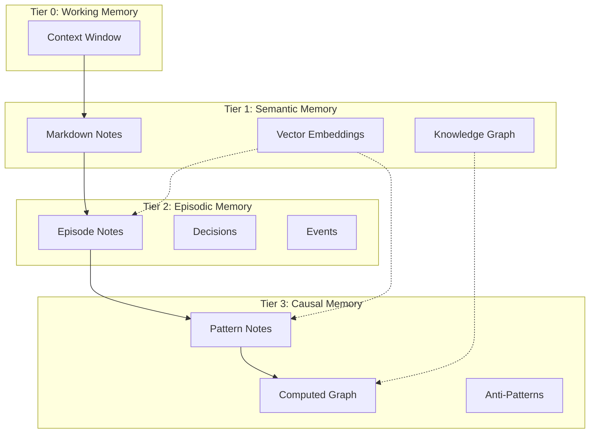

# Design: Episodic and Causal Memory Implementation

**Status**: Draft
**Date**: 2026-01-21
**ADR**: [[ADR-018 Episodic Causal Memory Architecture]]

## Overview

This document details the implementation plan for Tier 2 (Episodic Memory) and Tier 3 (Causal Graph) in brain, based on ADR-018 decisions.

## Architecture Summary



## Tier 2: Episodic Memory Implementation

### Episode Note Schema

#### Frontmatter Definition

```typescript
interface EpisodeFrontmatter {
  title: string;           // EPISODE-YYYY-MM-DD-session-NN
  type: 'episode';
  tags: string[];          // Must include 'episodic'
  permalink: string;       // episodes/{episode-id}
  outcome: 'success' | 'partial' | 'failure';
  task: string;
  duration_minutes?: number;
  metrics?: {
    tool_calls?: number;
    errors?: number;
    recoveries?: number;
    commits?: number;
    files_changed?: number;
  };
}
```

#### Decision Record Structure

Within the `## Decisions` section, each decision follows this format:

```markdown
### d001: [Decision Title]
- **Timestamp**: ISO 8601 datetime
- **Type**: design | implementation | test | recovery | routing
- **Context**: Situation description
- **Options**: List of considered alternatives
- **Chosen**: Selected option
- **Rationale**: Why this option was chosen
- **Outcome**: success | partial | failure
- **Effects**: [[d002]], [[e003]] (WikiLinks to caused decisions/events)
```

#### Event Record Structure

Within the `## Events Timeline` section:

```markdown
1. [2026-01-21T10:00:00Z] Event description #event_type
2. [2026-01-21T10:15:00Z] Another event #milestone
```

Event types (mapped to tags): `tool_call`, `error`, `milestone`, `handoff`, `commit`, `test`

### store_episode Tool

#### Input Schema

```typescript
interface StoreEpisodeArgs {
  session_id: string;      // e.g., "2026-01-21-session-42"
  task: string;            // High-level task description
  outcome: 'success' | 'partial' | 'failure';
  decisions?: Decision[];  // Structured decision array
  events?: Event[];        // Structured event array
  lessons?: string[];      // Lesson strings
  metrics?: Metrics;       // Session metrics
  project?: string;        // Target project
}

interface Decision {
  id: string;              // d001, d002, etc.
  timestamp: string;       // ISO 8601
  type: 'design' | 'implementation' | 'test' | 'recovery' | 'routing';
  context: string;
  options?: string[];
  chosen: string;
  rationale?: string;
  outcome: 'success' | 'partial' | 'failure';
  effects?: string[];      // IDs of caused decisions/events
}

interface Event {
  id: string;              // e001, e002, etc.
  timestamp: string;
  type: 'tool_call' | 'error' | 'milestone' | 'handoff' | 'commit' | 'test';
  content: string;
  caused_by?: string[];
  leads_to?: string[];
}

interface Metrics {
  duration_minutes?: number;
  tool_calls?: number;
  errors?: number;
  recoveries?: number;
  commits?: number;
  files_changed?: number;
}
```

#### Output

Returns the created episode note permalink and confirmation.

#### Implementation Location

`apps/mcp/src/tools/store-episode/index.ts`

### query_episodes Tool

#### Input Schema

```typescript
interface QueryEpisodesArgs {
  outcome?: 'success' | 'partial' | 'failure';
  task?: string;           // Substring match
  since?: string;          // ISO 8601 date
  limit?: number;          // Default 20, max 100
  project?: string;
}
```

#### Implementation

1. Use search tool with folder filter `episodes/`
2. Apply frontmatter filters for outcome, date
3. Text match on task field
4. Sort by date descending
5. Return structured episode summaries

### get_decision_sequence Tool

#### Input Schema

```typescript
interface GetDecisionSequenceArgs {
  episode_id: string;      // e.g., "episode-2026-01-21-session-42"
  project?: string;
}
```

#### Implementation

1. Read episode note by permalink
2. Parse `## Decisions` section
3. Extract structured decision data
4. Return sorted by timestamp

## Tier 3: Causal Memory Implementation

### Pattern Note Schema

#### Frontmatter Definition

```typescript
interface PatternFrontmatter {
  title: string;           // PATTERN-{name} or ANTIPATTERN-{name}
  type: 'pattern';
  tags: string[];          // Must include 'causal', 'pattern'
  permalink: string;       // patterns/{pattern-id}
  trigger: string;         // Condition that triggers pattern
  success_rate: number;    // 0-1
  occurrences: number;     // Count
  last_validated: string;  // ISO 8601 date
}
```

#### Content Sections

| Section | Required | Purpose |
|---------|----------|---------|
| `## Context` | Yes | When/why this pattern applies |
| `## Trigger` | Yes | Activation condition |
| `## Action` | Yes | Recommended action |
| `## Observations` | No | Evidence with tags |
| `## Causal Relationships` | No | causes/enables/prevents/correlates |
| `## Evidence Episodes` | No | Links to supporting episodes |
| `## Anti-Pattern Warning` | No | What to avoid |
| `## Relations` | Yes | Standard relations |

### add_pattern Tool

#### Input Schema

```typescript
interface AddPatternArgs {
  name: string;            // Pattern name (kebab-case)
  trigger: string;         // Activation condition
  action: string;          // Recommended action
  description?: string;    // Context/explanation
  success_rate?: number;   // Default 1.0
  evidence_episode?: string; // Episode that validates this
  causal_relationships?: CausalRelation[];
  is_antipattern?: boolean; // Creates ANTIPATTERN- prefix
  project?: string;
}

interface CausalRelation {
  type: 'causes' | 'enables' | 'prevents' | 'correlates';
  target: string;          // Target pattern/note title
}
```

#### Implementation

1. Check if pattern exists (by name match)
2. If exists: increment occurrences, update success_rate (running average), update last_validated
3. If new: create pattern note with frontmatter and sections
4. Add evidence episode link if provided
5. Return pattern permalink

### query_patterns Tool

#### Input Schema

```typescript
interface QueryPatternsArgs {
  trigger?: string;        // Match trigger field
  min_success_rate?: number; // Filter by success
  min_occurrences?: number;  // Filter by evidence count
  limit?: number;          // Default 20
  project?: string;
}
```

### get_causal_path Tool

#### Input Schema

```typescript
interface GetCausalPathArgs {
  from_pattern: string;    // Source pattern name or partial
  to_pattern: string;      // Target pattern name or partial
  max_depth?: number;      // Default 5, max 10
  project?: string;
}
```

#### Implementation

```typescript
async function getCausalPath(args: GetCausalPathArgs): Promise<CausalPathResult> {
  // 1. Build graph from pattern notes
  const patterns = await listPatternNotes(args.project);
  const graph = buildCausalGraph(patterns);

  // 2. Find source and target nodes
  const source = findNode(graph, args.from_pattern);
  const target = findNode(graph, args.to_pattern);

  // 3. BFS for shortest path
  const path = bfsPath(graph, source, target, args.max_depth);

  return {
    found: path !== null,
    path: path?.map(n => ({ id: n.id, label: n.label, type: n.type })),
    depth: path?.length - 1
  };
}

interface CausalGraph {
  nodes: Map<string, CausalNode>;
  edges: CausalEdge[];
}

interface CausalNode {
  id: string;
  label: string;
  type: 'pattern' | 'antipattern';
  success_rate: number;
  occurrences: number;
}

interface CausalEdge {
  source: string;
  target: string;
  type: 'causes' | 'enables' | 'prevents' | 'correlates';
}

function buildCausalGraph(patterns: PatternNote[]): CausalGraph {
  const nodes = new Map<string, CausalNode>();
  const edges: CausalEdge[] = [];

  for (const pattern of patterns) {
    // Add node
    nodes.set(pattern.permalink, {
      id: pattern.permalink,
      label: pattern.title,
      type: pattern.title.startsWith('ANTIPATTERN') ? 'antipattern' : 'pattern',
      success_rate: pattern.frontmatter.success_rate,
      occurrences: pattern.frontmatter.occurrences
    });

    // Parse causal relationships section
    const relationships = extractCausalRelationships(pattern.content);
    for (const rel of relationships) {
      edges.push({
        source: pattern.permalink,
        target: rel.target,
        type: rel.type
      });
    }
  }

  return { nodes, edges };
}
```

### get_antipatterns Tool

#### Input Schema

```typescript
interface GetAntipatternsArgs {
  max_success_rate?: number; // Default 0.3
  min_occurrences?: number;  // Default 2
  project?: string;
}
```

#### Implementation

1. Query patterns folder
2. Filter by success_rate <= threshold
3. Require occurrences >= minimum (prevents single-occurrence flukes)
4. Return sorted by success_rate ascending

## Session Protocol Integration

### Extract-SessionEpisode.ps1 Updates

The existing PowerShell script needs updates to output markdown format:

```powershell
function Export-SessionEpisode {
    param(
        [Parameter(Mandatory)]
        [string]$SessionLogPath,

        [string]$OutputFormat = 'markdown'  # New: 'json' for legacy, 'markdown' for brain
    )

    # Parse session log (existing logic)
    $sessionData = Parse-SessionLog -Path $SessionLogPath

    if ($OutputFormat -eq 'markdown') {
        # Generate markdown episode note
        $content = Format-EpisodeMarkdown -Data $sessionData
        $outputPath = "episodes/EPISODE-$($sessionData.SessionId).md"
        Set-Content -Path $outputPath -Value $content -Encoding UTF8
    }
    else {
        # Legacy JSON format
        $episode = Format-EpisodeJson -Data $sessionData
        $outputPath = "episodes/episode-$($sessionData.SessionId).json"
        $episode | ConvertTo-Json -Depth 10 | Set-Content -Path $outputPath
    }
}
```

### bootstrap_context Integration

Update `bootstrap_context` to include recent episodes:

```typescript
// In sectionQueries.ts
export async function queryEpisodeSections(
  project: string
): Promise<ContextNote[]> {
  // Query recent failure episodes for warnings
  const failureEpisodes = await searchNotes({
    project,
    query: 'outcome:failure',
    folder: 'episodes',
    limit: 3,
    since: daysAgo(7)
  });

  // Query high-value patterns
  const patterns = await searchNotes({
    project,
    query: 'type:pattern success_rate:>0.7',
    folder: 'patterns',
    limit: 5
  });

  return [...failureEpisodes, ...patterns];
}
```

## Migration Strategy

### Phase 1: Schema Migration Tools

Create `migrate-episodes.ts` script:

```typescript
interface AiAgentsEpisode {
  id: string;
  session: string;
  timestamp: string;
  outcome: string;
  task: string;
  decisions: AiAgentsDecision[];
  events: AiAgentsEvent[];
  metrics: object;
  lessons: string[];
}

async function migrateEpisode(jsonPath: string, project: string): Promise<void> {
  const episode: AiAgentsEpisode = JSON.parse(await readFile(jsonPath, 'utf-8'));

  // Transform to markdown
  const markdown = transformEpisodeToMarkdown(episode);

  // Write to brain notes
  await writeNote({
    project,
    folder: 'episodes',
    title: `EPISODE-${episode.session}`,
    content: markdown
  });
}

function transformEpisodeToMarkdown(episode: AiAgentsEpisode): string {
  const frontmatter = yaml.dump({
    title: `EPISODE-${episode.session}`,
    type: 'episode',
    tags: ['episodic', 'memory', `session-${episode.session.split('-').pop()}`],
    permalink: `episodes/episode-${episode.session}`,
    outcome: episode.outcome,
    task: episode.task,
    metrics: episode.metrics
  });

  const decisions = episode.decisions.map(d => formatDecision(d)).join('\n\n');
  const events = episode.events.map(e => formatEvent(e)).join('\n');
  const lessons = episode.lessons.map(l => `- ${l}`).join('\n');

  return `---
${frontmatter}---

# EPISODE-${episode.session}

## Context
Migrated from ai-agents episodic memory.

## Observations
${episode.decisions.map(d => `- [decision:${d.id}] ${d.chosen} #${d.type}`).join('\n')}
${episode.events.map(e => `- [event:${e.id}] ${e.content} #${e.type}`).join('\n')}

## Decisions
${decisions}

## Events Timeline
${events}

## Lessons Learned
${lessons}

## Relations
- migrated_from [[ai-agents episodic memory]]
`;
}
```

### Phase 2: Causal Graph Migration

```typescript
interface AiAgentsCausalGraph {
  version: string;
  updated: string;
  nodes: AiAgentsNode[];
  edges: AiAgentsEdge[];
  patterns: AiAgentsPattern[];
}

async function migrateCausalGraph(jsonPath: string, project: string): Promise<void> {
  const graph: AiAgentsCausalGraph = JSON.parse(await readFile(jsonPath, 'utf-8'));

  // Create pattern notes from patterns array
  for (const pattern of graph.patterns) {
    await createPatternNote(pattern, project, graph);
  }

  // Create notes for nodes that aren't patterns
  for (const node of graph.nodes.filter(n => n.type !== 'pattern')) {
    await createObservationNote(node, project, graph);
  }
}

function createPatternNote(
  pattern: AiAgentsPattern,
  project: string,
  graph: AiAgentsCausalGraph
): Promise<void> {
  // Find edges where this pattern is source
  const outgoingEdges = graph.edges.filter(e =>
    graph.nodes.find(n => n.id === e.source)?.label === pattern.name
  );

  const causalRelationships = outgoingEdges.map(e => {
    const targetNode = graph.nodes.find(n => n.id === e.target);
    return `- ${e.type} [[${targetNode?.label || e.target}]]`;
  }).join('\n');

  const content = `---
title: PATTERN-${kebabCase(pattern.name)}
type: pattern
tags: [causal, pattern]
permalink: patterns/pattern-${kebabCase(pattern.name)}
trigger: ${pattern.trigger}
success_rate: ${pattern.success_rate}
occurrences: ${pattern.occurrences}
last_validated: ${pattern.last_used || new Date().toISOString().split('T')[0]}
---

# PATTERN-${kebabCase(pattern.name)}

## Context
${pattern.description || 'Migrated from ai-agents causal graph.'}

## Trigger
${pattern.trigger}

## Action
${pattern.action}

## Observations
- [evidence] ${pattern.occurrences} occurrences documented #metrics
- [evidence] ${(pattern.success_rate * 100).toFixed(0)}% success rate #metrics

## Causal Relationships
${causalRelationships || '(none)'}

## Relations
- migrated_from [[ai-agents causal graph]]
`;

  return writeNote({ project, folder: 'patterns', content });
}
```

### Phase 3: Validation

```typescript
async function validateMigration(project: string): Promise<ValidationReport> {
  const report: ValidationReport = {
    episodes: { total: 0, valid: 0, issues: [] },
    patterns: { total: 0, valid: 0, issues: [] },
    graphIntegrity: { totalEdges: 0, validEdges: 0, brokenLinks: [] }
  };

  // Validate episodes
  const episodes = await listNotes({ project, folder: 'episodes' });
  for (const ep of episodes) {
    report.episodes.total++;
    const validation = validateEpisodeNote(ep);
    if (validation.valid) {
      report.episodes.valid++;
    } else {
      report.episodes.issues.push(validation);
    }
  }

  // Validate patterns and graph integrity
  const patterns = await listNotes({ project, folder: 'patterns' });
  const graph = buildCausalGraph(patterns);

  for (const edge of graph.edges) {
    report.graphIntegrity.totalEdges++;
    if (graph.nodes.has(edge.target)) {
      report.graphIntegrity.validEdges++;
    } else {
      report.graphIntegrity.brokenLinks.push({
        source: edge.source,
        target: edge.target,
        type: edge.type
      });
    }
  }

  return report;
}
```

## File Structure

### Tool Implementation Files

```text
apps/mcp/src/tools/
├── store-episode/
│   ├── index.ts          # Handler
│   ├── schema.ts         # Input/output schemas
│   └── formatters.ts     # Markdown generation
├── query-episodes/
│   ├── index.ts
│   └── schema.ts
├── get-decision-sequence/
│   ├── index.ts
│   └── schema.ts
├── add-pattern/
│   ├── index.ts
│   ├── schema.ts
│   └── merger.ts         # Pattern update logic
├── query-patterns/
│   ├── index.ts
│   └── schema.ts
├── get-causal-path/
│   ├── index.ts
│   ├── schema.ts
│   └── graphBuilder.ts   # Graph computation
└── get-antipatterns/
    ├── index.ts
    └── schema.ts
```

### Migration Scripts

```text
apps/mcp/scripts/
├── migrate-episodes.ts
├── migrate-causal-graph.ts
└── validate-migration.ts
```

## Testing Strategy

### Unit Tests

| Test File | Coverage |
|-----------|----------|
| `store-episode.test.ts` | Episode creation, frontmatter validation |
| `formatters.test.ts` | Markdown generation, decision/event formatting |
| `graphBuilder.test.ts` | Graph construction, BFS path finding |
| `merger.test.ts` | Pattern update logic, running averages |

### Integration Tests

| Test File | Coverage |
|-----------|----------|
| `episode-lifecycle.test.ts` | Create -> query -> retrieve flow |
| `pattern-lifecycle.test.ts` | Create -> update -> query flow |
| `causal-reasoning.test.ts` | Path finding, antipattern detection |
| `migration.test.ts` | ai-agents data import/export |

### Sample Test Data

Create test fixtures in `apps/mcp/src/tools/__fixtures__/`:

- `sample-episode.json` - ai-agents format
- `sample-episode.md` - Expected brain format
- `sample-causal-graph.json` - ai-agents format
- `sample-patterns/` - Expected brain pattern notes

## Implementation Timeline

| Phase | Duration | Deliverables |
|-------|----------|--------------|
| Phase 1 | 1 week | `store_episode`, `query_episodes`, episode markdown schema |
| Phase 2 | 1 week | `add_pattern`, `query_patterns`, pattern markdown schema |
| Phase 3 | 1 week | `get_causal_path`, `get_antipatterns`, graph computation |
| Phase 4 | 3 days | Migration scripts, validation |
| Phase 5 | 2 days | Session protocol integration, `bootstrap_context` updates |

## Open Questions

1. **Embedding Strategy**: Should episodes/patterns get full-note embeddings or section-level chunks?
   - Recommendation: Start with full-note, evaluate chunking if search quality suffers

2. **Graph Caching**: Should computed causal graph be cached?
   - Recommendation: Compute on-demand initially, add caching if performance issues arise

3. **Cross-Project Patterns**: Should patterns be shareable across projects?
   - Recommendation: Keep project-scoped initially, evaluate sharing mechanism later

## References

- [[ADR-018 Episodic Causal Memory Architecture]] - Decision record
- ai-agents ReflexionMemory.psm1 - Original implementation
- ai-agents episode.schema.json - Original schema
- ai-agents causal-graph.schema.json - Original schema
