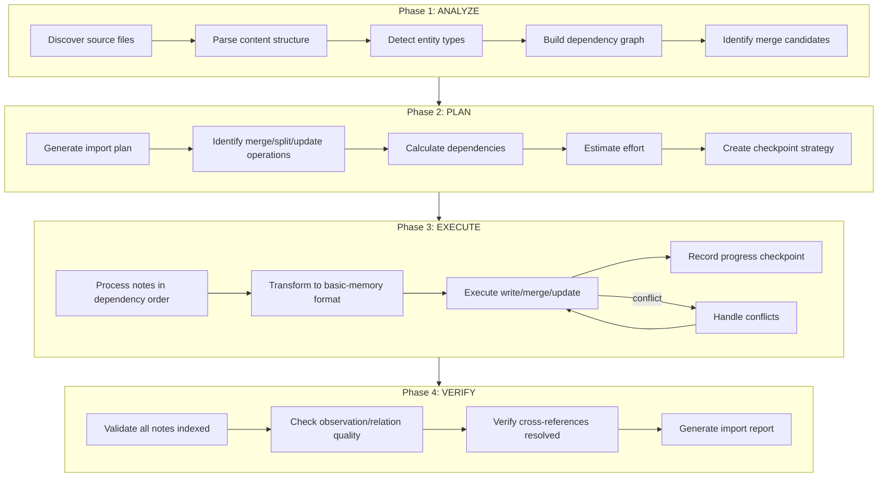

# Architecture Design: import-memories Agent

**Date**: 2026-02-01
**Author**: Architect Agent
**Status**: PROPOSED
**Related ADRs**: ADR-007 (Memory-First), ADR-019 (Memory Governance), ADR-020 (Configuration Architecture)

---

## 1. Executive Summary

This document defines the architecture for the `import-memories` agent, an AI-driven tool for intelligently importing external notes and memories into Brain with transformation to basic-memory format.

**Core Value Proposition**: Replace brittle script-based migration with intelligent, resumable, AI-driven import that can analyze, merge, split, and transform content.

---

## 2. Agent Definition

### 2.1 Identity

```yaml
name: import-memories
description: >
  Intelligent import of external notes/memories into Brain with AI-driven
  transformation to basic-memory format. Analyzes source structure, plans
  optimal import strategy, executes with progress tracking, and verifies
  compliance. Supports resume after interruption.
model: claude-sonnet-4-5  # Standard workflow complexity
```

### 2.2 Activation Profile

**Keywords**: import, migrate, convert, memories, notes, transform, basic-memory, external, source, batch

**Summon**: I need to import external notes or memories into Brain. This could be from another memory system, markdown files, or structured documents. I want intelligent transformation that preserves meaning, creates proper observations and relations, and handles merging with existing notes.

### 2.3 Tools Required

| Tool | Purpose | Access Level |
|------|---------|--------------|
| `mcp__plugin_brain_brain__search` | Find existing notes for merge detection | READ |
| `mcp__plugin_brain_brain__read_note` | Read existing notes, read source files | READ |
| `mcp__plugin_brain_brain__write_note` | Create/update notes after transformation | WRITE |
| `mcp__plugin_brain_brain__edit_note` | Update existing notes (merge scenarios) | WRITE |
| `mcp__plugin_brain_brain__list_directory` | Enumerate existing notes | READ |
| `mcp__plugin_brain_brain__build_context` | Initialize project context | READ |
| `Read` (filesystem) | Read source files from external paths | READ |
| `Glob` (filesystem) | Discover source files | READ |

---

## 3. Import Workflow (4-Phase)



### 3.1 Phase 1: ANALYZE

**Input**: Source path, optional source schema hint

**Actions**:

1. **Discover files**: Recursively scan source path for markdown files
2. **Parse structure**: Extract frontmatter, headings, content sections
3. **Detect entity types**: Infer from path patterns, filename conventions, content
4. **Build dependency graph**: Detect wikilinks, references, explicit relations
5. **Identify merge candidates**: Find notes covering same topic or with high similarity

**Output**: Analysis report with file inventory, entity type mapping, merge recommendations

### 3.2 Phase 2: PLAN

**Input**: Analysis report, existing Brain notes index

**Actions**:

1. **Generate import plan**: Ordered list of operations
2. **Identify operations**: CREATE (new note), MERGE (combine notes), UPDATE (add to existing), SPLIT (break apart)
3. **Calculate dependencies**: Ensure wikilink targets exist before references
4. **Estimate effort**: File count, transformation complexity
5. **Create checkpoints**: Define resumption points every N files

**Output**: Import plan document with operation sequence and checkpoints

### 3.3 Phase 3: EXECUTE

**Input**: Import plan, progress state

**Actions**:

1. **Resume detection**: Check for existing progress file, resume from last checkpoint
2. **Process in order**: Follow dependency-ordered plan
3. **Transform content**: Apply basic-memory format (frontmatter, observations, relations)
4. **Execute operation**: write_note (CREATE), edit_note (UPDATE/MERGE)
5. **Record progress**: Update checkpoint after each successful write
6. **Handle conflicts**: Prompt for resolution or apply configured strategy

**Output**: Progress updates, success/failure per note

### 3.4 Phase 4: VERIFY

**Input**: Expected notes from plan, actual Brain state

**Actions**:

1. **Index validation**: Confirm all notes discoverable via search
2. **Quality check**: Verify min 3 observations, min 2 relations per note
3. **Reference resolution**: Ensure all wikilinks resolve to valid targets
4. **Generate report**: Summary with counts, quality metrics, issues

**Output**: Import verification report

---

## 4. Progress Tracking Mechanism

### 4.1 Progress File Location

```text
{brain_project_path}/.import/
├── current-import.json       # Active import state
├── completed/                # Historical import records
│   └── import-{timestamp}.json
└── recovery/                 # Partial state for recovery
    └── import-{timestamp}-recovery.json
```

### 4.2 Progress File Schema

```typescript
interface ImportProgress {
  id: string;                    // UUID for this import job
  started_at: string;            // ISO timestamp
  source_path: string;           // Original source location
  target_project: string;        // Brain project name
  status: "analyzing" | "planning" | "executing" | "verifying" | "complete" | "failed";

  // Phase tracking
  current_phase: number;         // 1-4
  phase_progress: {
    analyze: PhaseProgress;
    plan: PhaseProgress;
    execute: PhaseProgress;
    verify: PhaseProgress;
  };

  // Execution tracking
  plan_file: string;             // Path to import plan
  last_checkpoint: string;       // ID of last completed checkpoint
  completed_operations: string[]; // IDs of completed operations
  failed_operations: FailedOperation[];

  // Statistics
  stats: ImportStats;
}

interface PhaseProgress {
  status: "pending" | "running" | "complete" | "failed";
  started_at?: string;
  completed_at?: string;
  items_total: number;
  items_processed: number;
  errors: string[];
}

interface FailedOperation {
  operation_id: string;
  source_file: string;
  error: string;
  timestamp: string;
  retry_count: number;
}

interface ImportStats {
  files_discovered: number;
  notes_created: number;
  notes_merged: number;
  notes_updated: number;
  observations_generated: number;
  relations_detected: number;
  quality_warnings: number;
}
```

### 4.3 Checkpoint Strategy

**Checkpoint frequency**: After every 10 successful operations or after each merge operation

**Checkpoint content**:

- Last completed operation ID
- Current position in plan
- Cumulative statistics
- Timestamp

**Resume behavior**:

1. Load progress file
2. Find last checkpoint
3. Skip completed operations
4. Resume from first incomplete operation

---

## 5. Resumability Approach

### 5.1 Crash Recovery Protocol

```text
On agent start:
1. Check for {project}/.import/current-import.json
2. IF exists AND status != "complete":
   a. Load progress state
   b. Validate source files still exist
   c. Prompt: "Found incomplete import from {timestamp}. Resume? [Y/n]"
   d. IF resume: Skip to Phase 3 (EXECUTE) at last checkpoint
   e. IF not resume: Archive to recovery/, start fresh
3. ELSE: Start new import
```

### 5.2 Idempotency Guarantees

| Operation | Idempotency Strategy |
|-----------|---------------------|
| CREATE | Check if note exists with same permalink before writing |
| MERGE | Track merged note IDs, skip if target already contains merged sources |
| UPDATE | Use edit_note with replace_section, append is additive |
| SPLIT | Track split source, skip if target notes already exist |

### 5.3 Rollback Capability

**Partial rollback**: Delete notes created since last checkpoint

**Full rollback**:

1. Query notes with `imported_from` tag matching import ID
2. Delete all matched notes
3. Clear progress file

**Limitation**: Source file modifications (if any) cannot be automatically rolled back

---

## 6. Merging Strategy

### 6.1 Merge Candidate Detection

**Triggers for merge consideration**:

1. **Title similarity**: >0.8 Jaccard similarity on title tokens
2. **Reference clustering**: Notes with bidirectional wikilinks
3. **Folder grouping**: Multiple small notes (<100 lines) in same source folder
4. **Explicit markers**: Source frontmatter with `merge_with` field
5. **Topic overlap**: LLM-detected thematic similarity (Phase 2)

### 6.2 Merge Operations

```typescript
type MergeOperation =
  | { type: "merge_into_existing"; sources: string[]; target: string }
  | { type: "merge_create_new"; sources: string[]; new_title: string }
  | { type: "split_into_multiple"; source: string; target_count: number }
  | { type: "update_existing"; source: string; target: string; sections: string[] };
```

### 6.3 Merge Content Generation

**Merged note structure**:

```markdown
---
title: {merged_title}
type: {primary_entity_type}
tags: [{union_of_tags}]
merged_from: [{source_permalinks}]
import_id: {import_job_id}
---

# {merged_title}

## Context

{AI-synthesized context from all sources}

## Observations

{Deduplicated, categorized observations from all sources}
- [fact] From Source A: {observation}
- [decision] From Source B: {observation}

## Relations

{Deduplicated relations with provenance}
- relates_to [[Target]] (from Source A)
- implements [[Other]] (from Source B)

## Merged Content

### From: {source_a_title}
{Key content preserved}

### From: {source_b_title}
{Key content preserved}
```

### 6.4 Merge Conflict Resolution

| Conflict Type | Default Strategy | User Override |
|---------------|------------------|---------------|
| Title collision | Append numeric suffix | Prompt for new title |
| Contradicting facts | Keep both with source attribution | Prompt for resolution |
| Circular references | Break cycle at lower-priority node | Prompt for preference |
| Entity type mismatch | Use type from largest source | Prompt for type |

---

## 7. Brain MCP Tools Needed

### 7.1 Existing Tools (Sufficient)

| Tool | Usage in Import |
|------|-----------------|
| `search` | Find existing notes for merge detection, verify imports |
| `read_note` | Load existing notes, validate merge targets |
| `write_note` | Create new notes after transformation |
| `edit_note` | Update existing notes in merge/update scenarios |
| `list_directory` | Enumerate existing notes by folder |
| `build_context` | Initialize project, resolve paths |

### 7.2 Tool Enhancements Recommended

**Enhancement 1**: `write_note` with conflict mode

```typescript
interface WriteNoteEnhanced {
  // ... existing params
  conflict_mode?: "fail" | "overwrite" | "merge" | "skip";
  import_metadata?: {
    import_id: string;
    source_path: string;
    imported_at: string;
  };
}
```

**Enhancement 2**: `bulk_write_notes` for efficiency

```typescript
interface BulkWriteNotes {
  notes: Array<{
    folder: string;
    title: string;
    content: string;
  }>;
  project?: string;
  dry_run?: boolean;
}
```

**Enhancement 3**: `search` with import metadata filter

```typescript
interface SearchEnhanced {
  // ... existing params
  filter?: {
    import_id?: string;
    imported_after?: string;
    has_tag?: string;
  };
}
```

---

## 8. Comparison: Agent vs Migration Scripts

### 8.1 Existing Migration Tools

| Tool | Location | Purpose | Limitations |
|------|----------|---------|-------------|
| `migrate_agents` | `apps/mcp/src/tools/migrate-agents/` | Transform .agents/ to basic-memory | Fixed source format, no merge, no resume |
| `migrate_cluster` | `apps/mcp/src/tools/migrate-cluster/` | Execute cluster migrations | Requires prior analysis, no transformation |
| `analyze_project` | `apps/mcp/src/tools/analyze-project/` | Conformance checking, import preview | Analysis only, no execution |

### 8.2 Capability Comparison

| Capability | migrate_agents | migrate_cluster | analyze_project | import-memories Agent |
|------------|----------------|-----------------|-----------------|----------------------|
| Source analysis | Fixed patterns | Cluster-based | Comprehensive | AI-driven |
| Entity detection | Directory mapping | N/A | Schema-based | AI inference |
| Transformation | Template-based | Move only | N/A | AI-generated |
| Merge support | No | No | Detection only | Full merge |
| Split support | No | No | No | Yes |
| Update existing | No | Yes | No | Yes |
| Progress tracking | No | No | N/A | Checkpointed |
| Resume support | No | No | N/A | Full resume |
| Conflict handling | Fail | Fail | N/A | Configurable |
| Quality validation | Basic counts | No | Detection | AI validation |

### 8.3 Recommendation

**Verdict**: The import-memories agent should REPLACE migrate_agents and SUBSUME migrate_cluster functionality.

**Rationale**:

1. **Flexibility**: Agent can handle arbitrary source formats, not just .agents/
2. **Intelligence**: AI-driven transformation produces higher quality observations/relations
3. **Resilience**: Progress tracking enables reliable batch imports
4. **Merge capability**: Critical for consolidating related content
5. **Maintenance**: Single agent vs multiple specialized tools

**Migration path**:

1. Phase 1: Implement import-memories agent with core capabilities
2. Phase 2: Deprecate migrate_agents tool
3. Phase 3: Remove migrate_agents, migrate_cluster from MCP tools
4. Keep analyze_project for conformance checking (different purpose)

---

## 9. Implementation Considerations

### 9.1 Location

```text
apps/claude-plugin/agents/import-memories.md  # Agent definition
apps/claude-plugin/skills/import-memories/    # Supporting skill (optional)
├── SKILL.md
├── schemas/                                  # Import plan, progress schemas
└── templates/                                # Note templates by entity type
```

### 9.2 Dependencies

- Brain MCP tools (existing)
- filesystem read access (existing)
- Progress file storage (new capability)

### 9.3 Effort Estimate

| Component | Effort | Notes |
|-----------|--------|-------|
| Agent definition | 4h | Prompt engineering, workflow design |
| Progress tracking | 8h | File I/O, schema, resume logic |
| Transformation logic | 12h | AI prompts for observation/relation extraction |
| Merge logic | 8h | Similarity detection, content merging |
| Verification | 4h | Quality checks, report generation |
| Testing | 8h | Unit tests, integration tests |
| Documentation | 4h | User guide, examples |
| **Total** | **48h** | ~6 person-days |

---

## 10. Open Questions

1. **Source schema library**: Should we maintain a library of known source schemas (ai-agents, Obsidian, Notion exports)?

2. **LLM transformation**: Full AI transformation vs template-based extraction with AI enhancement?

3. **Batch size limits**: Maximum files per import job? Memory constraints?

4. **Conflict notification**: How to notify user of conflicts requiring intervention?

5. **Scheduled imports**: Support for periodic re-import from evolving sources?

---

## 11. Appendices

### A. Entity Type Detection Heuristics

| Signal | Entity Type | Confidence |
|--------|-------------|------------|
| Filename: `ADR-*`, `adr-*` | decision | HIGH |
| Filename: `SESSION-*`, `session-*` | session | HIGH |
| Filename: `REQ-*`, `req-*` | requirement | HIGH |
| Path: `*/sessions/*` | session | MEDIUM |
| Path: `*/architecture/*`, `*/decisions/*` | decision | MEDIUM |
| Path: `*/planning/*` | feature | MEDIUM |
| Content: `## Decision`, `## Consequences` | decision | MEDIUM |
| Content: `## Objective`, `## Work Log` | session | MEDIUM |
| Frontmatter: `type: decision` | decision | HIGH |
| Default | note | LOW |

### B. Observation Category Mapping

| Content Pattern | Category |
|-----------------|----------|
| `decided`, `chose`, `selected` | decision |
| `must`, `shall`, `required` | requirement |
| `issue`, `problem`, `bug` | problem |
| `fixed`, `resolved`, `solution` | solution |
| `learned`, `insight`, `realized` | insight |
| `use`, `approach`, `method` | technique |
| `result`, `outcome`, `status` | outcome |
| Default | fact |

### C. Sample Import Plan

```json
{
  "import_id": "imp-2026-02-01-001",
  "source_path": "/Users/peter.kloss/Downloads/ai-agents-main/.agents",
  "target_project": "brain",
  "total_files": 231,
  "checkpoints": ["chk-50", "chk-100", "chk-150", "chk-200", "chk-231"],
  "operations": [
    {
      "id": "op-001",
      "type": "create",
      "source": ".agents/architecture/ADR-001.md",
      "target": "decisions/adr-001.md",
      "entity_type": "decision",
      "checkpoint": null
    },
    {
      "id": "op-050",
      "type": "merge",
      "sources": [".agents/sessions/2025-12-01-session-01.md", ".agents/sessions/2025-12-01-session-02.md"],
      "target": "sessions/session-2025-12-01.md",
      "merge_reason": "Same day, related tasks",
      "checkpoint": "chk-50"
    }
  ]
}
```

---

## 12. Conclusion

The import-memories agent provides a significant upgrade over existing migration scripts by adding AI-driven transformation, merge capabilities, progress tracking, and resumability. It consolidates multiple tools into a single intelligent agent that can handle diverse source formats and produce high-quality basic-memory notes.

**Recommendation**: Proceed with implementation following this design, prioritizing core import workflow and progress tracking before advanced features like intelligent merging.

**Next Steps**:

1. Create ADR for import-memories agent architecture decisions
2. Route to planner for task breakdown
3. Implement Phase 1 (Analyze) and Phase 3 (Execute) first
4. Add Phase 2 (Plan) and Phase 4 (Verify) iteratively
