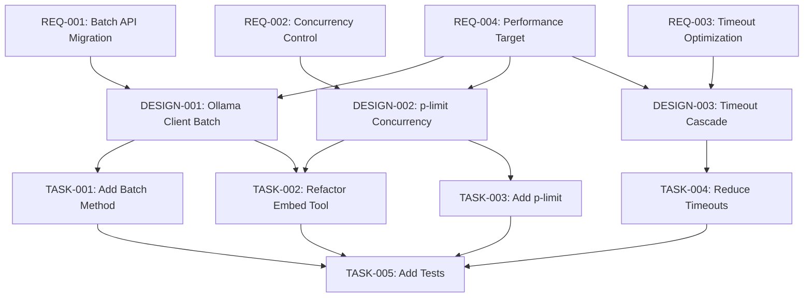

# ADR-002 Embedding Performance Optimization - Specification

This directory contains the 3-tier specification for ADR-002: Embedding Performance Optimization via Batch API Migration with Concurrency Control.

## Decision Reference

**ADR**: `.agents/architecture/ADR-002-embedding-performance-optimization.md`

**Status**: Accepted

**Decision**: Migrate to Ollama batch API (`/api/embed`) with p-limit concurrency control (4 concurrent notes)

**Expected Improvement**: 13x throughput increase (10 minutes → 46 seconds for 700 notes)

## Specification Structure

```text
ADR-002-embedding-performance/
├── requirements/         # EARS-format requirements (WHAT/WHY)
│   ├── REQ-001-batch-api-migration.md
│   ├── REQ-002-concurrency-control.md
│   ├── REQ-003-timeout-optimization.md
│   └── REQ-004-performance-target.md
├── design/              # Technical architecture (HOW)
│   ├── DESIGN-001-ollama-client-batch.md
│   ├── DESIGN-002-plimit-concurrency.md
│   └── DESIGN-003-timeout-cascade.md
└── tasks/               # Implementation work items
    ├── TASK-001-add-batch-method.md
    ├── TASK-002-refactor-embed-tool.md
    ├── TASK-003-add-plimit.md
    ├── TASK-004-reduce-timeouts.md
    └── TASK-005-add-tests.md
```

## Traceability Chain

### Requirements → Design → Tasks



### Traceability Matrix

| Requirement | Design | Tasks |
|-------------|--------|-------|
| REQ-001: Batch API Migration | DESIGN-001: Ollama Client Batch | TASK-001, TASK-002 |
| REQ-002: Concurrency Control | DESIGN-002: p-limit Concurrency | TASK-002, TASK-003 |
| REQ-003: Timeout Optimization | DESIGN-003: Timeout Cascade | TASK-004 |
| REQ-004: Performance Target | DESIGN-001, DESIGN-002, DESIGN-003 | TASK-005 (validation) |

### Verification

- [x] Every REQ has at least one DESIGN
- [x] Every DESIGN has at least one TASK
- [x] No orphan requirements (all REQs traced to DESIGN)
- [x] No orphan designs (all DESIGNs traced to TASK)
- [x] All TASKs trace back to at least one DESIGN
- [x] Performance target (REQ-004) covered by validation task (TASK-005)

## Implementation Order

### Phase 0: Prerequisites (30 min)

- **TASK-003**: Add p-limit dependency
- Verify Ollama version (≥0.1.26 with `/api/embed`)

### Phase 1: Core Changes (5 hours)

- **TASK-001**: Add `generateBatchEmbeddings` to OllamaClient (2h)
- **TASK-002**: Refactor embed tool to use batch API (3h)

### Phase 2: Optimization (1 hour)

- **TASK-004**: Reduce timeouts for fail-fast errors (1h)

### Phase 3: Validation (4 hours)

- **TASK-005**: Add unit and integration tests (4h)
- Capture baseline performance before optimization
- Validate 5x minimum improvement (REQ-004)

**Total Estimate**: 10.5 hours

## Acceptance Criteria Summary

### Requirements Level

| Requirement | Acceptance Criteria |
|-------------|-------------------|
| REQ-001 | `/api/embed` endpoint used, batch request format, index alignment validated |
| REQ-002 | p-limit installed, concurrency = 4, artificial delays removed |
| REQ-003 | Ollama timeout = 60s, Go timeout = 5min, fail-fast errors with context |
| REQ-004 | 700 notes complete in <120s (5x minimum), <60s target (10x) |

### Design Level

| Design | Key Components |
|--------|---------------|
| DESIGN-001 | `generateBatchEmbeddings` method, batch request/response types, error handling |
| DESIGN-002 | `processNotesWithConcurrency`, p-limit integration, memory monitoring |
| DESIGN-003 | OLLAMA_CONFIG.TIMEOUT = 60000, HTTPClientTimeout = 5min, OllamaError context |

### Task Level

| Task | Deliverable |
|------|------------|
| TASK-001 | OllamaClient with batch method |
| TASK-002 | Embed tool using concurrent batch processing |
| TASK-003 | p-limit dependency in package.json |
| TASK-004 | Reduced timeouts in config and Go client |
| TASK-005 | Test suite with >80% coverage, performance validation |

## Success Metrics

| Metric | Baseline | Minimum Target | Stretch Goal |
|--------|----------|---------------|--------------|
| **700 notes** | 600s (10 min) | 120s (5x) | 46s (13x) |
| **100 notes** | 85s | 17s (5x) | 7s (12x) |
| **HTTP requests** | 2100 (3 chunks avg) | 700 (batch per note) | 700 |
| **Delay overhead** | 52% | 0% | 0% |

## Rollback Plan

If performance does not meet minimum 5x threshold or reliability decreases:

1. **Immediate**: Revert `TASK-002` (embed tool) to use single-text API
2. **Short-term**: Re-add delays if Ollama resource exhaustion occurs
3. **Indicators**:
   - Ollama 500 error rate >5%
   - Embedding throughput <5x baseline
   - Memory pressure on Ollama server

All changes are backward compatible. Database schema unchanged.

## Related Documentation

- **ADR-002**: `.agents/architecture/ADR-002-embedding-performance-optimization.md`
- **Analysis 025**: `.agents/analysis/025-embedding-performance-research.md`
- **Analysis 026**: `.agents/analysis/026-timeout-changes-performance-review.md`
- **Analysis 027**: `.agents/analysis/027-embedding-performance-final-findings.md`

## Questions or Issues

For questions about this specification:

1. Review ADR-002 for decision rationale
2. Review Analysis documents for research findings
3. Check traceability matrix for requirement coverage
4. Consult implementer if acceptance criteria are unclear
