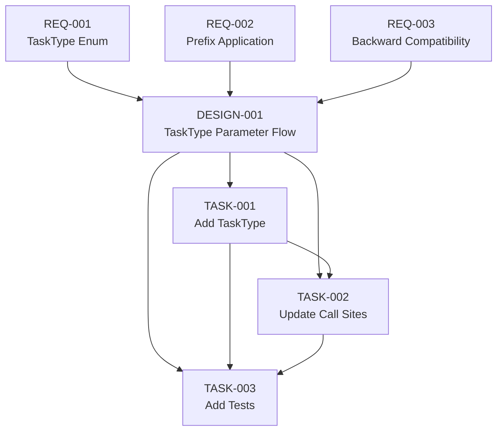

# ADR-003 Embedding Task Prefix Specification

Lightweight 3-tier specification for adding TaskType parameter to embedding methods per Nomic AI vendor requirements.

## Overview

**ADR**: [ADR-003: Embedding Quality: Task Prefix Specification for nomic-embed-text](../../architecture/ADR-003-embedding-task-prefix.md)

**Scope**: Add TaskType parameter with "search_document:" and "search_query:" prefixes to embedding generation methods.

**Effort**: 20 minutes (XS complexity quick fix)

**Context**: ADR-003 builds on ADR-002's batch API foundation. The batch method already has TaskType parameter; this spec adds it to the single-text method and updates call sites.

## Traceability Chain

## Requirements (Tier 1)

| ID | Title | Category | Priority |
|----|-------|----------|----------|
| [REQ-001](requirements/REQ-001-task-type-enum.md) | Task type enum for embedding prefixes | Functional | P0 |
| [REQ-002](requirements/REQ-002-prefix-application.md) | Apply task-appropriate prefix to embedding text | Functional | P0 |
| [REQ-003](requirements/REQ-003-backward-compatibility.md) | Backward compatibility with default task type | Non-functional | P0 |

## Design (Tier 2)

| ID | Title | Requirements Addressed |
|----|-------|----------------------|
| [DESIGN-001](design/DESIGN-001-task-type-parameter.md) | TaskType parameter flow through embedding pipeline | REQ-001, REQ-002, REQ-003 |

## Tasks (Tier 3)

| ID | Title | Complexity | Estimate | Blocks |
|----|-------|------------|----------|--------|
| [TASK-001](tasks/TASK-001-add-task-type.md) | Add TaskType enum and update OllamaClient signatures | XS | 10m | TASK-002, TASK-003 |
| [TASK-002](tasks/TASK-002-update-call-sites.md) | Update embed tool and search service call sites | XS | 5m | TASK-003 |
| [TASK-003](tasks/TASK-003-add-tests.md) | Add unit tests for task type prefix application | XS | 5m | - |

## Implementation Sequence

1. **TASK-001**: Define TaskType, update generateEmbedding signature, apply prefix
2. **TASK-002**: Update embed tool ("search_document") and search service ("search_query")
3. **TASK-003**: Add 3 unit tests (document, query, default)

## Total Effort

| Complexity | Tasks | Estimate |
|------------|-------|----------|
| XS | 3 | 20 minutes |

## Key Differences from ADR-002

**ADR-002**: Epic-scale performance migration (10.5 hours, 5 tasks, concurrency control)
**ADR-003**: Quick quality fix (20 minutes, 3 tasks, parameter addition)

Specifications are proportional to implementation effort.

## Coordination with ADR-002

**Assumption**: ADR-002 implementation included TaskType parameter in generateBatchEmbeddings per coordination requirement.

**Verification Required**: TASK-001 includes coordination check to verify batch method has TaskType parameter.

**If Missing**: TASK-001 implementer adds TaskType to batch method following same pattern as single-text method.

## Validation Requirements

From ADR-003:

- [ ] Unit tests verify both task type prefixes
- [ ] Unit test verifies default parameter behavior
- [ ] Embed tool uses "search_document" (manual test)
- [ ] Search service uses "search_query" (manual test)
- [ ] TypeScript compilation succeeds
- [ ] No linting errors

## Related Artifacts

- **ADR**: [ADR-003](../../architecture/ADR-003-embedding-task-prefix.md)
- **Analysis**: [Analysis 030](../../analysis/030-markdown-sanitization-for-embeddings.md)
- **Related Spec**: [ADR-002 Embedding Performance](../ADR-002-embedding-performance/README.md)
