# ADR-016 Inngest Workflows Specification

> **Scope**: Original ADR-016 (TASK-001 to TASK-014)

**Generated**: 2026-01-18
**Updated**: 2026-01-19 (All requirements accepted, all tasks completed, TASK-014 REMOVED)
**ADR**: ADR-016 Automatic Session Protocol Enforcement via Inngest Workflows

## Artifacts Created

### Requirements (5)

| ID | Title | Priority | Status | File |
|----|-------|----------|--------|------|
| REQ-001 | Session state schema with orchestrator workflow tracking | P0 | accepted | `.agents/specs/requirements/REQ-001-session-state-schema.md` |
| REQ-002 | Optimistic locking for concurrent session updates | P0 | accepted | `.agents/specs/requirements/REQ-002-optimistic-locking.md` |
| REQ-003 | HMAC-SHA256 signing for session state integrity | P0 | accepted | `.agents/specs/requirements/REQ-003-hmac-signing.md` |
| REQ-004 | Fail-closed behavior for PreToolUse hook gate checks | P0 | accepted | `.agents/specs/requirements/REQ-004-fail-closed-behavior.md` |
| REQ-005 | Brain note persistence model for session state | P0 | accepted | `.agents/specs/requirements/REQ-005-brain-note-persistence.md` |

### Design (2)

| ID | Title | Priority | Status | File |
|----|-------|----------|--------|------|
| DESIGN-001 | Session state architecture with Brain note persistence | P0 | accepted | `.agents/specs/design/DESIGN-001-session-state-architecture.md` |
| DESIGN-002 | HANDOFF.md to Brain Notes Migration Schema | P0 | accepted | Note: Referenced in ADR-016 Milestone 3.1, no separate design file required |

### Tasks (39 active, 1 removed)

| ID | Title | Complexity | Estimate | Status | File |
|----|-------|------------|----------|--------|------|
| TASK-001 | Implement session state TypeScript interfaces | S | 3h | complete | `.agents/specs/tasks/TASK-001-session-state-types.md` |
| TASK-002 | Implement HMAC-SHA256 session state signing | S | 3h | complete | `.agents/specs/tasks/TASK-002-hmac-signing.md` |
| TASK-003 | Implement Brain note persistence for session state | M | 5h | complete | `.agents/specs/tasks/TASK-003-brain-persistence.md` |
| TASK-004 | Implement optimistic locking for concurrent updates | M | 4h | complete | `.agents/specs/tasks/TASK-004-optimistic-locking.md` |
| TASK-005 | Implement SessionService with workflow tracking | L | 8h | complete | `.agents/specs/tasks/TASK-005-session-service.md` |
| TASK-006 | Implement Brain CLI bridge for hook integration | M | 6h | complete | `.agents/specs/tasks/TASK-006-brain-cli-bridge.md` |
| TASK-007 | Implement session history compaction logic | M | 5h | complete | `.agents/specs/tasks/TASK-007-compaction-logic.md` |
| TASK-008 | Remove file cache code and migrate to Brain notes | S | 2h | complete | `.agents/specs/tasks/TASK-008-remove-file-cache.md` |
| TASK-009 | Write comprehensive unit tests for all components | L | 8h | complete | `.agents/specs/tasks/TASK-009-unit-tests.md` |
| TASK-010 | Implement Inngest workflow setup | S | 3h | complete | `.agents/specs/tasks/TASK-010-inngest-workflow-setup.md` |
| TASK-011 | Implement session-protocol-start workflow | M | 6h | complete | `.agents/specs/tasks/TASK-011-session-protocol-start-workflow.md` |
| TASK-012 | Implement session-protocol-end workflow | M | 4h | complete | `.agents/specs/tasks/TASK-012-session-protocol-end-workflow.md` |
| TASK-013 | Implement orchestrator-agent-routing workflow | L | 7h | complete | `.agents/specs/tasks/TASK-013-orchestrator-agent-routing-workflow.md` |
| TASK-014 | REMOVED - HANDOFF migration covered by Milestone 3.1 | - | - | removed | N/A |
| TASK-015 | Implement Validate-Consistency in Go | L | 8h | complete | `.agents/specs/tasks/TASK-015-implement-validate-consistency.md` |
| TASK-016 | Integrate Validate-Consistency into Enforcement | M | 4h | complete | `.agents/specs/tasks/TASK-016-integrate-validate-consistency.md` |
| TASK-017 | Implement Pre-PR Validation Runner in Go | M | 6h | complete | `.agents/specs/tasks/TASK-017-implement-pre-pr-validation.md` |
| TASK-018 | Integrate Pre-PR Validation into Enforcement | S | 2h | complete | `.agents/specs/tasks/TASK-018-integrate-pre-pr-validation.md` |
| TASK-019 | Implement Skill Violation Detection in Go | M | 5h | complete | `.agents/specs/tasks/TASK-019-implement-skill-violation-detection.md` |
| TASK-020 | Integrate Skill Violation Detection into Enforcement | S | 2h | complete | `.agents/specs/tasks/TASK-020-integrate-skill-violation-detection.md` |
| TASK-021 | Implement Test Coverage Gap Detection in Go | M | 5h | complete | `.agents/specs/tasks/TASK-021-implement-test-coverage-gap-detection.md` |
| TASK-022 | Integrate Test Coverage Gap Detection into Enforcement | S | 2h | complete | `.agents/specs/tasks/TASK-022-integrate-test-coverage-gap-detection.md` |
| TASK-023 | Implement Skill Existence Verification in Go | S | 4h | complete | `.agents/specs/tasks/TASK-023-implement-skill-exists-check.md` |
| TASK-024 | Integrate Skill Existence Verification into Enforcement | S | 2h | complete | `.agents/specs/tasks/TASK-024-integrate-skill-exists-check.md` |
| TASK-025 | Implement Memory Index Validation in Go | L | 8h | complete | `.agents/specs/tasks/TASK-025-implement-memory-index-validation.md` |
| TASK-026 | Integrate Memory Index Validation into Enforcement | S | 2h | complete | `.agents/specs/tasks/TASK-026-integrate-memory-index-validation.md` |
| TASK-027 | Implement PR Description Validation in Go | M | 6h | complete | `.agents/specs/tasks/TASK-027-implement-pr-description-validation.md` |
| TASK-028 | Integrate PR Description Validation into Enforcement | S | 2h | complete | `.agents/specs/tasks/TASK-028-integrate-pr-description-validation.md` |
| TASK-029 | Implement Skill Format Validation in Go | M | 5h | complete | `.agents/specs/tasks/TASK-029-implement-skill-format-validation.md` |
| TASK-030 | Integrate Skill Format Validation into Enforcement | S | 2h | complete | `.agents/specs/tasks/TASK-030-integrate-skill-format-validation.md` |
| TASK-031 | Implement Traceability Validation in Go | L | 8h | complete | `.agents/specs/tasks/TASK-031-implement-traceability-validation.md` |
| TASK-032 | Integrate Traceability Validation into Enforcement | S | 2h | complete | `.agents/specs/tasks/TASK-032-integrate-traceability-validation.md` |
| TASK-033 | Implement Session Protocol Validation in Go | L | 10h | complete | `.agents/specs/tasks/TASK-033-implement-session-validation.md` |
| TASK-034 | Integrate Session Protocol Validation into Enforcement | M | 4h | complete | `.agents/specs/tasks/TASK-034-integrate-session-validation.md` |
| TASK-035 | Implement Batch PR Review Worktree Management in Go | M | 6h | complete | `.agents/specs/tasks/TASK-035-implement-batch-pr-review.md` |
| TASK-036 | Integrate Batch PR Review into Enforcement | S | 2h | complete | `.agents/specs/tasks/TASK-036-integrate-batch-pr-review.md` |
| TASK-037 | Implement PR Discovery and Classification in Go | L | 8h | complete | `.agents/specs/tasks/TASK-037-implement-pr-maintenance.md` |
| TASK-038 | Integrate PR Maintenance into Enforcement | M | 4h | complete | `.agents/specs/tasks/TASK-038-integrate-pr-maintenance.md` |
| TASK-039 | Implement Slash Command Format Validation in Go | M | 5h | complete | `.agents/specs/tasks/TASK-039-implement-slash-command-validation.md` |
| TASK-040 | Integrate Slash Command Validation into Enforcement | S | 2h | complete | `.agents/specs/tasks/TASK-040-integrate-slash-command-validation.md` |

## Traceability Matrix

### Requirements → Design

| Requirement | Design |
|-------------|--------|
| REQ-001: Session state schema | DESIGN-001: Component 1 (Session State Schema) |
| REQ-002: Optimistic locking | DESIGN-001: Component 4 (Optimistic Locking) |
| REQ-003: HMAC signing | DESIGN-001: Component 3 (Session State Signing) |
| REQ-004: Fail-closed behavior | DESIGN-001: Component 6 (Brain CLI Bridge) |
| REQ-005: Brain note persistence | DESIGN-001: Component 2 (Brain Note Persistence) |
| ADR-016 Milestone 3.1 | DESIGN-002: HANDOFF.md Migration Schema |

### Design → Tasks

| Design Component | Tasks |
|------------------|-------|
| DESIGN-001: Component 1 (Session State Schema) | TASK-001 |
| DESIGN-001: Component 2 (Brain Note Persistence) | TASK-003 |
| DESIGN-001: Component 3 (Session State Signing) | TASK-002 |
| DESIGN-001: Component 4 (Optimistic Locking) | TASK-004 |
| DESIGN-001: Component 5 (Session Service) | TASK-005 |
| DESIGN-001: Component 6 (Brain CLI Bridge) | TASK-006 |
| DESIGN-001: Component 7 (Session History Compaction) | TASK-007 |
| DESIGN-001: File Cache Removal | TASK-008 |
| DESIGN-001: Testing | TASK-009 |
| **ADR-016 Milestone 2.1** | TASK-010 (Inngest Workflow Setup) |
| **ADR-016 Milestone 2.2** | TASK-011 (session-protocol-start workflow) |
| **ADR-016 Milestone 2.3** | TASK-012 (session-protocol-end workflow) |
| **ADR-016 Milestone 2.4** | TASK-013 (orchestrator-agent-routing workflow) |
| **DESIGN-002: HANDOFF.md Migration** | TASK-014 (Migration implementation) |

### Complete Traceability Chain

```mermaid
flowchart TD
    REQ001[REQ-001: Session State Schema]
    REQ002[REQ-002: Optimistic Locking]
    REQ003[REQ-003: HMAC Signing]
    REQ004[REQ-004: Fail-Closed Behavior]
    REQ005[REQ-005: Brain Note Persistence]

    DESIGN001[DESIGN-001: Session State Architecture]
    DESIGN002[DESIGN-002: HANDOFF Migration Schema]

    TASK001[TASK-001: TypeScript Interfaces]
    TASK002[TASK-002: HMAC Signing]
    TASK003[TASK-003: Brain Persistence]
    TASK004[TASK-004: Optimistic Locking]
    TASK005[TASK-005: SessionService]
    TASK006[TASK-006: Brain CLI Bridge]
    TASK007[TASK-007: Compaction Logic]
    TASK008[TASK-008: Remove File Cache]
    TASK009[TASK-009: Unit Tests]
    TASK010[TASK-010: Inngest Setup]
    TASK011[TASK-011: Protocol Start Workflow]
    TASK012[TASK-012: Protocol End Workflow]
    TASK013[TASK-013: Agent Routing Workflow]
    TASK014[TASK-014: HANDOFF Migration]

    REQ001 --> DESIGN001
    REQ002 --> DESIGN001
    REQ003 --> DESIGN001
    REQ004 --> DESIGN001
    REQ005 --> DESIGN001

    DESIGN001 --> TASK001
    DESIGN001 --> TASK002
    DESIGN001 --> TASK003
    DESIGN001 --> TASK004
    DESIGN001 --> TASK005
    DESIGN001 --> TASK006
    DESIGN001 --> TASK007
    DESIGN001 --> TASK008
    DESIGN001 --> TASK009
    DESIGN001 --> TASK010
    DESIGN001 --> TASK011
    DESIGN001 --> TASK012
    DESIGN001 --> TASK013

    DESIGN002 --> TASK014

    style REQ001 fill:#e1f5fe
    style REQ002 fill:#e1f5fe
    style REQ003 fill:#e1f5fe
    style REQ004 fill:#e1f5fe
    style REQ005 fill:#e1f5fe
    style DESIGN001 fill:#fff3e0
    style DESIGN002 fill:#fff3e0
    style TASK001 fill:#e8f5e9
    style TASK002 fill:#e8f5e9
    style TASK003 fill:#e8f5e9
    style TASK004 fill:#e8f5e9
    style TASK005 fill:#e8f5e9
    style TASK006 fill:#e8f5e9
    style TASK007 fill:#e8f5e9
    style TASK008 fill:#e8f5e9
    style TASK009 fill:#e8f5e9
    style TASK010 fill:#e8f5e9
    style TASK011 fill:#e8f5e9
    style TASK012 fill:#e8f5e9
    style TASK013 fill:#e8f5e9
    style TASK014 fill:#e8f5e9
```



## Implementation Sequence

### Phase 1: Foundation (TASK-001, TASK-002)

**Duration**: 6h
**Dependencies**: None

1. TASK-001: Implement TypeScript interfaces (3h)
2. TASK-002: Implement HMAC signing (3h)

**Deliverables**:

- Type definitions with compile-time safety
- HMAC signing and verification functions

---

### Phase 2: Persistence (TASK-003, TASK-004)

**Duration**: 9h
**Dependencies**: Phase 1 complete

1. TASK-003: Implement Brain note persistence (5h)
2. TASK-004: Implement optimistic locking (4h)

**Deliverables**:

- Brain note read/write operations
- Version-based concurrent update handling

---

### Phase 3: Service Layer (TASK-005, TASK-007)

**Duration**: 13h
**Dependencies**: Phase 2 complete

1. TASK-005: Implement SessionService (8h)
2. TASK-007: Implement compaction logic (5h)

**Deliverables**:

- High-level session state API
- Agent history compaction algorithm

---

### Phase 4: Integration (TASK-006, TASK-008)

**Duration**: 8h
**Dependencies**: Phase 3 complete

1. TASK-006: Implement Brain CLI bridge (6h)
2. TASK-008: Remove file cache code (2h)

**Deliverables**:

- Brain CLI commands for hooks
- Fail-closed PreToolUse hook behavior
- File cache elimination

---

### Phase 5: Testing (TASK-009)

**Duration**: 8h
**Dependencies**: Phase 4 complete

1. TASK-009: Write comprehensive unit tests (8h)

**Deliverables**:

- Unit tests with >= 90% coverage
- Edge case and error condition tests

---

### Phase 6: Workflows (TASK-010, TASK-011, TASK-012, TASK-013)

**Duration**: 20h
**Dependencies**: Phase 1-4 complete (session state infrastructure ready)

1. TASK-010: Implement Inngest workflow setup (3h)
2. TASK-011: Implement session-protocol-start workflow (6h)
3. TASK-012: Implement session-protocol-end workflow (4h)
4. TASK-013: Implement orchestrator-agent-routing workflow (7h)

**Deliverables**:

- Inngest client initialized
- Session protocol start workflow (8 steps)
- Session protocol end workflow (6 steps)
- Agent routing workflows (invocation + completion)

---

### Phase 7: Migration (TASK-014)

**Duration**: 3h
**Dependencies**: TASK-003 (Brain persistence operational)

1. TASK-014: Implement HANDOFF.md migration to Brain notes (3h)

**Deliverables**:

- Migration script with validation
- HANDOFF.md archived
- Brain notes created with structured data

---

## Estimated Effort

| Complexity | Count | Hours |
|------------|-------|-------|
| S (Small) | 5 | 14 |
| M (Medium) | 5 | 25 |
| L (Large) | 3 | 23 |
| XL (Extra Large) | 0 | 0 |
| **Total** | **14** | **67** |

**Estimated Calendar Time**: 2.5 weeks (assuming 30h/week)

## Dependency Graph

```text
TASK-001 ──┬─→ TASK-002 ──┐
           │              │
           └─→ TASK-003 ←─┘
                  │
                  ├─→ TASK-004 ──┐
                  │              │
                  └──────────────┴─→ TASK-005 ──┬─→ TASK-006 ──┐
                                                │              │
                                                ├─→ TASK-007   │
                                                │              │
                                                └──────────────┴─→ TASK-008 ──→ TASK-009

TASK-010 ──┬─→ TASK-011
           ├─→ TASK-012
           └─→ TASK-013

TASK-003 ──→ TASK-014
```

**Critical Path**: TASK-001 → TASK-003 → TASK-005 → TASK-006 → TASK-009

**Parallel Tracks**:

- Workflows (TASK-010 → TASK-011/012/013) can start after Phase 4
- Migration (TASK-014) can start after TASK-003

## Key Technical Decisions

| Decision | Rationale |
|----------|-----------|
| **Brain notes as single source of truth** | Eliminates dual storage (file cache + Brain notes), simplifies architecture |
| **Optimistic locking with version field** | No distributed locks needed, 3-retry handles transient conflicts |
| **HMAC-SHA256 signing** | Detects tampering, server-side secret prevents forgery |
| **Fail-closed hook behavior** | Security by default, read-only tools allowed when state unknown |
| **Compaction at 10 invocations** | Balances completeness (history preserved) with performance (bounded growth) |
| **Brain CLI bridge for hooks** | Hooks cannot access MCP directly, CLI provides clean interface |
| **Inngest for workflows** | Event-driven orchestration, built-in retries, observable execution |
| **HANDOFF.md migration to JSON** | Structured data enables semantic search and validation |

## Validation Checklist

### EARS Compliance

- [x] REQ-001: Uses EARS pattern (WHEN/THE SYSTEM SHALL/SO THAT)
- [x] REQ-002: Uses EARS pattern (WHEN/THE SYSTEM SHALL/SO THAT)
- [x] REQ-003: Uses EARS pattern (WHEN/THE SYSTEM SHALL/SO THAT)
- [x] REQ-004: Uses EARS pattern (WHEN/THE SYSTEM SHALL/SO THAT)
- [x] REQ-005: Uses EARS pattern (WHEN/THE SYSTEM SHALL/SO THAT)
- [x] All requirements have measurable acceptance criteria
- [x] All requirements avoid vague terminology

### Traceability

- [x] All requirements link to DESIGN-001
- [x] All design components link to requirements
- [x] All tasks link to design components
- [x] No orphan requirements (all have design coverage)
- [x] No orphan design components (all have task implementation)
- [x] Complete chain: REQ → DESIGN → TASK
- [x] New tasks (TASK-010 through TASK-014) link to DESIGN-001 or DESIGN-002

### Testability

- [x] All requirements have binary pass/fail acceptance criteria
- [x] All tasks have testing requirements sections
- [x] TASK-009 provides comprehensive unit test coverage
- [x] Edge cases identified in task acceptance criteria
- [x] Integration tests defined for workflows (TASK-011, TASK-012, TASK-013)

## Recommended Next Steps

1. **Route to critic** for specification review and validation
2. After critic approval, route to **implementer** for Phase 1 (TASK-001, TASK-002)
3. Follow implementation sequence through Phase 7
4. Route to **qa** for integration testing after Phase 6 complete (workflows operational)
5. Route to **retrospective** after full implementation

## Open Questions

1. **Compaction retention period**: How long should historical Brain notes be retained?
   - Suggested: 30 days, configurable via environment variable
   - Decision needed before TASK-007 implementation

2. **Concurrent workflow coordination**: Should Inngest workflows coordinate to avoid version conflicts?
   - Suggested: Sequential execution via Inngest steps
   - Decision needed before TASK-011 implementation

3. **Brain note size limits**: What is maximum practical size for session state notes?
   - Suggested: Performance testing during TASK-009
   - May require compaction threshold adjustment

4. **MCP startup performance**: How long does session state load take on restart?
   - Suggested: Benchmark during TASK-003 integration tests
   - May require caching strategy optimization

5. **Historical HANDOFF.md entries**: Should TASK-014 migration include entries older than 30 days?
   - Suggested: Migrate last 30 days, archive rest for manual review
   - Decision needed before TASK-014 implementation

## Critic Feedback Addressed

**Status**: Specification revision complete per critic feedback

**Artifacts Added**:

- DESIGN-002: HANDOFF.md to Brain Notes Migration Schema
- TASK-010: Implement Inngest workflow setup (3h estimate)
- TASK-011: Implement session-protocol-start workflow (6h estimate)
- TASK-012: Implement session-protocol-end workflow (4h estimate)
- TASK-013: Implement orchestrator-agent-routing workflow (7h estimate)
- TASK-014: Implement HANDOFF.md migration (3h estimate)

**Traceability**:

- All new tasks link to DESIGN-001 (workflows) or DESIGN-002 (migration)
- Updated traceability matrix includes new tasks
- Dependency graph updated with workflow and migration tasks

**Total Effort Updated**:

- Previous: 44h across 9 tasks
- Current: 67h across 14 tasks
- Increase: 23h (workflow implementation + migration)

## Complete Task List (ADR-016)

All 39 active tasks for ADR-016 Session Protocol Enforcement:

| ID | Title | Status | Complexity | Effort |
|----|-------|--------|------------|--------|
| TASK-001 | Implement session state TypeScript interfaces | complete | S | 3h |
| TASK-002 | Implement HMAC-SHA256 session state signing | complete | S | 3h |
| TASK-003 | Implement Brain note persistence for session state | complete | M | 5h |
| TASK-004 | Implement optimistic locking for concurrent updates | complete | M | 4h |
| TASK-005 | Implement SessionService with workflow tracking | complete | L | 8h |
| TASK-006 | Implement Brain CLI bridge for hook integration | complete | M | 6h |
| TASK-007 | Implement session history compaction logic | complete | M | 5h |
| TASK-008 | Remove file cache code and migrate to Brain notes | complete | S | 2h |
| TASK-009 | Write comprehensive unit tests for all components | complete | L | 8h |
| TASK-010 | Implement Inngest workflow setup | complete | S | 3h |
| TASK-011 | Implement session-protocol-start workflow | complete | M | 6h |
| TASK-012 | Implement session-protocol-end workflow | complete | M | 4h |
| TASK-013 | Implement orchestrator-agent-routing workflow | complete | L | 7h |
| TASK-014 | REMOVED - HANDOFF migration covered by Milestone 3.1 | removed | - | - |
| TASK-015 | Implement Validate-Consistency in Go | complete | L | 8h |
| TASK-016 | Integrate Validate-Consistency into Enforcement | complete | M | 4h |
| TASK-017 | Implement Pre-PR Validation Runner in Go | complete | M | 6h |
| TASK-018 | Integrate Pre-PR Validation into Enforcement | complete | S | 2h |
| TASK-019 | Implement Skill Violation Detection in Go | complete | M | 5h |
| TASK-020 | Integrate Skill Violation Detection into Enforcement | complete | S | 2h |
| TASK-021 | Implement Test Coverage Gap Detection in Go | complete | M | 5h |
| TASK-022 | Integrate Test Coverage Gap Detection into Enforcement | complete | S | 2h |
| TASK-023 | Implement Skill Existence Verification in Go | complete | S | 4h |
| TASK-024 | Integrate Skill Existence Verification into Enforcement | complete | S | 2h |
| TASK-025 | Implement Memory Index Validation in Go | complete | L | 8h |
| TASK-026 | Integrate Memory Index Validation into Enforcement | complete | S | 2h |
| TASK-027 | Implement PR Description Validation in Go | complete | M | 6h |
| TASK-028 | Integrate PR Description Validation into Enforcement | complete | S | 2h |
| TASK-029 | Implement Skill Format Validation in Go | complete | M | 5h |
| TASK-030 | Integrate Skill Format Validation into Enforcement | complete | S | 2h |
| TASK-031 | Implement Traceability Validation in Go | complete | L | 8h |
| TASK-032 | Integrate Traceability Validation into Enforcement | complete | S | 2h |
| TASK-033 | Implement Session Protocol Validation in Go | complete | L | 10h |
| TASK-034 | Integrate Session Protocol Validation into Enforcement | complete | M | 4h |
| TASK-035 | Implement Batch PR Review Worktree Management in Go | complete | M | 6h |
| TASK-036 | Integrate Batch PR Review into Enforcement | complete | S | 2h |
| TASK-037 | Implement PR Discovery and Classification in Go | complete | L | 8h |
| TASK-038 | Integrate PR Maintenance into Enforcement | complete | M | 4h |
| TASK-039 | Implement Slash Command Format Validation in Go | complete | M | 5h |
| TASK-040 | Integrate Slash Command Validation into Enforcement | complete | S | 2h |

**Phase Summary**:

| Phase | Tasks | Status |
|-------|-------|--------|
| Phase 1-3: Session Protocol (TASK-001 to TASK-013) | 13 active | complete |
| Phase 4-6: Validation Scripts (TASK-015 to TASK-040) | 26 active | complete |
| **Total** | **39 active** (TASK-014 removed) | **complete** |

## References

- **ADR-016**: Automatic Session Protocol Enforcement via Inngest Workflows
- **AGENTS.md**: Agent catalog and session protocol reference
- **SESSION-PROTOCOL.md**: Canonical session protocol requirements
- **DESIGN-001**: Complete architecture with 7 components and technology decisions
- **DESIGN-002**: HANDOFF.md to Brain Notes Migration Schema
