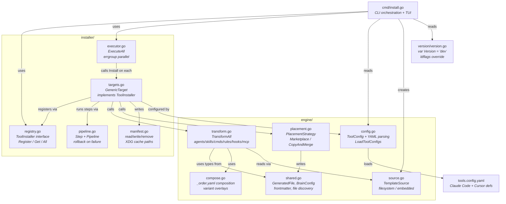
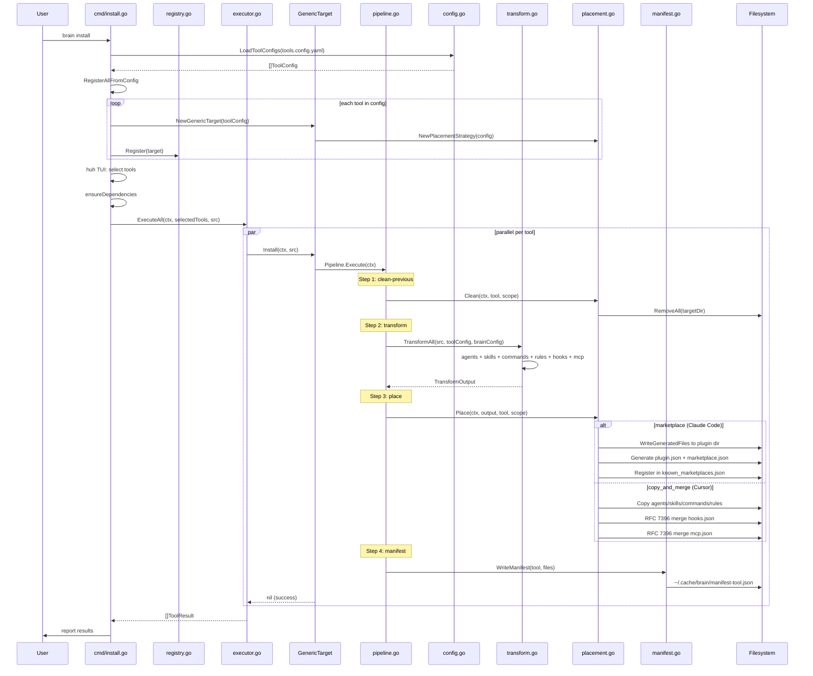
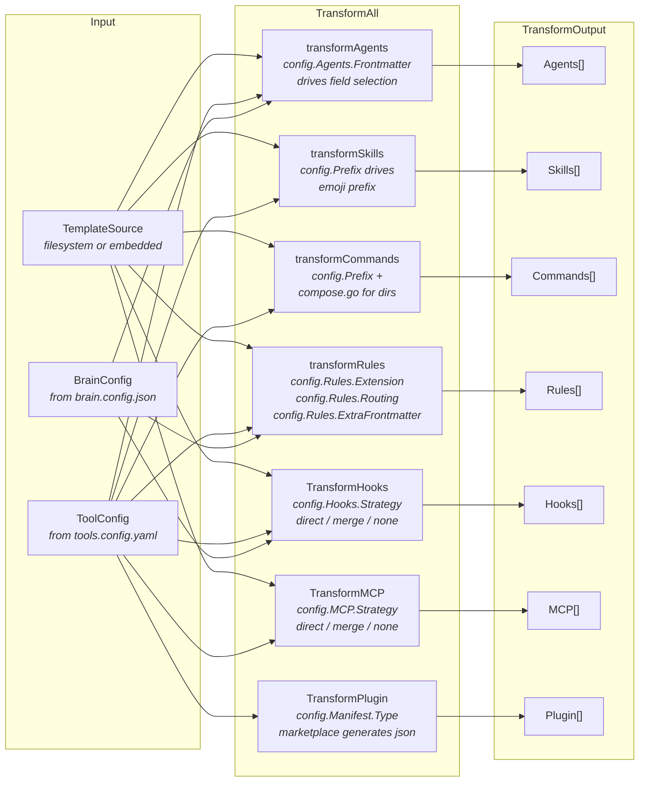

# Installer Architecture Diagrams

## 1. Package Dependency Flow

```mermaid
graph TD
    CMD["cmd/install.go<br/><i>CLI orchestration + TUI</i>"]

    subgraph installer["installer/"]
        REG["registry.go<br/><i>ToolInstaller interface</i><br/><i>Register / Get / All</i>"]
        TGT["targets.go<br/><i>GenericTarget</i><br/><i>implements ToolInstaller</i>"]
        PIPE["pipeline.go<br/><i>Step + Pipeline</i><br/><i>rollback on failure</i>"]
        EXEC["executor.go<br/><i>ExecuteAll</i><br/><i>errgroup parallel</i>"]
        MAN["manifest.go<br/><i>read/write/remove</i><br/><i>XDG cache paths</i>"]
    end

    subgraph engine["engine/"]
        CFG["config.go<br/><i>ToolConfig + YAML parsing</i><br/><i>LoadToolConfigs</i>"]
        TFM["transform.go<br/><i>TransformAll</i><br/><i>agents/skills/cmds/rules/hooks/mcp</i>"]
        PLC["placement.go<br/><i>PlacementStrategy</i><br/><i>Marketplace / CopyAndMerge</i>"]
        SHR["shared.go<br/><i>GeneratedFile, BrainConfig</i><br/><i>frontmatter, file discovery</i>"]
        CMP["compose.go<br/><i>_order.yaml composition</i><br/><i>variant overlays</i>"]
        SRC["source.go<br/><i>TemplateSource</i><br/><i>filesystem / embedded</i>"]
    end

    VER["version/version.go<br/><i>var Version = 'dev'</i><br/><i>ldflags override</i>"]
    YAML["tools.config.yaml<br/><i>Claude Code + Cursor defs</i>"]

    CMD -->|"uses"| REG
    CMD -->|"uses"| EXEC
    CMD -->|"reads"| CFG
    CMD -->|"creates"| SRC
    CMD -->|"reads"| VER

    EXEC -->|"calls Install on each"| TGT
    TGT -->|"registers via"| REG
    TGT -->|"runs steps via"| PIPE
    TGT -->|"calls"| TFM
    TGT -->|"calls"| PLC
    TGT -->|"writes"| MAN
    TGT -->|"configured by"| CFG

    CFG -->|"loads"| YAML
    TFM -->|"uses types from"| SHR
    TFM -->|"uses"| CMP
    TFM -->|"reads via"| SRC
    PLC -->|"writes"| SHR
```

## 2. Install Flow (runtime sequence)

```mermaid
sequenceDiagram
    participant User
    participant CLI as cmd/install.go
    participant Reg as registry.go
    participant Exec as executor.go
    participant GT as GenericTarget
    participant Pipe as pipeline.go
    participant Cfg as config.go
    participant Tfm as transform.go
    participant Plc as placement.go
    participant Man as manifest.go
    participant Disk as Filesystem

    User->>CLI: brain install
    CLI->>Cfg: LoadToolConfigs(tools.config.yaml)
    Cfg-->>CLI: []ToolConfig

    CLI->>CLI: RegisterAllFromConfig
    loop each tool in config
        CLI->>GT: NewGenericTarget(toolConfig)
        GT->>Plc: NewPlacementStrategy(config)
        CLI->>Reg: Register(target)
    end

    CLI->>CLI: huh TUI: select tools
    CLI->>CLI: ensureDependencies

    CLI->>Exec: ExecuteAll(ctx, selectedTools, src)

    par parallel per tool
        Exec->>GT: Install(ctx, src)
        GT->>Pipe: Pipeline.Execute(ctx)

        Note over Pipe: Step 1: clean-previous
        Pipe->>Plc: Clean(ctx, tool, scope)
        Plc->>Disk: RemoveAll(targetDir)

        Note over Pipe: Step 2: transform
        Pipe->>Tfm: TransformAll(src, toolConfig, brainConfig)
        Tfm->>Tfm: agents + skills + commands + rules + hooks + mcp
        Tfm-->>Pipe: TransformOutput

        Note over Pipe: Step 3: place
        Pipe->>Plc: Place(ctx, output, tool, scope)

        alt marketplace (Claude Code)
            Plc->>Disk: WriteGeneratedFiles to plugin dir
            Plc->>Disk: Generate plugin.json + marketplace.json
            Plc->>Disk: Register in known_marketplaces.json
        else copy_and_merge (Cursor)
            Plc->>Disk: Copy agents/skills/commands/rules
            Plc->>Disk: RFC 7396 merge hooks.json
            Plc->>Disk: RFC 7396 merge mcp.json
        end

        Note over Pipe: Step 4: manifest
        Pipe->>Man: WriteManifest(tool, files)
        Man->>Disk: ~/.cache/brain/manifest-tool.json

        GT-->>Exec: nil (success)
    end

    Exec-->>CLI: []ToolResult
    CLI->>User: report results
```

## 3. Transform Engine Detail

```mermaid
graph LR
    subgraph input["Input"]
        SRC["TemplateSource<br/><i>filesystem or embedded</i>"]
        CFG["ToolConfig<br/><i>from tools.config.yaml</i>"]
        BC["BrainConfig<br/><i>from brain.config.json</i>"]
    end

    subgraph transform["TransformAll"]
        A["transformAgents<br/><i>config.Agents.Frontmatter<br/>drives field selection</i>"]
        S["transformSkills<br/><i>config.Prefix drives<br/>emoji prefix</i>"]
        C["transformCommands<br/><i>config.Prefix +<br/>compose.go for dirs</i>"]
        R["transformRules<br/><i>config.Rules.Extension<br/>config.Rules.Routing<br/>config.Rules.ExtraFrontmatter</i>"]
        H["TransformHooks<br/><i>config.Hooks.Strategy<br/>direct / merge / none</i>"]
        M["TransformMCP<br/><i>config.MCP.Strategy<br/>direct / merge / none</i>"]
        P["TransformPlugin<br/><i>config.Manifest.Type<br/>marketplace generates json</i>"]
    end

    subgraph output["TransformOutput"]
        OA["Agents[]"]
        OS["Skills[]"]
        OC["Commands[]"]
        OR["Rules[]"]
        OH["Hooks[]"]
        OM["MCP[]"]
        OP["Plugin[]"]
    end

    SRC --> A & S & C & R & H & M
    CFG --> A & S & C & R & H & M & P
    BC --> A & R & H

    A --> OA
    S --> OS
    C --> OC
    R --> OR
    H --> OH
    M --> OM
    P --> OP
```
